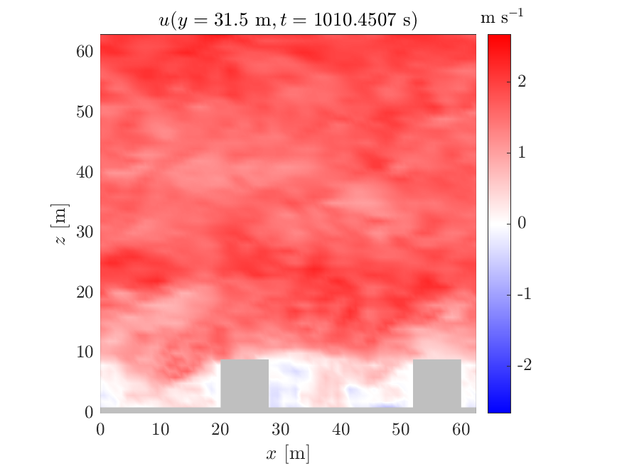

# uDALES 

This is the development repository for the uDALES (urban Dutch Atmospheric Large Eddy Simulation) model. It contains the uDALES software source-code, tests, documentation, and examples with tools to pre- and post-process inputs and outputs.

 

## Overview

With continuing urbanization, challenges associated with the urban environment such as air quality, heat islands, pedestrian thermal comfort, and wind loads on tall buildings, are increasingly relevant. Our ability to realistically capture processes such as the transport of heat, moisture, momentum and pollutants, and those of radiative transfer in urban environments is key to understanding and facing these challenges.

The turbulent nature of the urban flow field and the inherent heterogeneity and wide range of scales associated with the urban environment result in a complex modelling problem. Large-eddy simulation (LES) is an approach to turbulence modelling used in computational fluid dynamics to simulate turbulent flows over a wide range of spatial and temporal scales. LES is one of the most promising tools to model the interactions typical of urban areas due to its ability to resolve the urban flow field at resolutions of _O_(1 m, 0.1 s), over spatial domains of _O_(100 m), and time periods of _O_(1 h). Although there are many scalable LES models for atmospheric flows, to our knowledge, only few are capable of explicitly representing buildings and of modelling the full range of urban processes (e.g. PALM-4U; Resler et al. 2017; Maronga et al. 2020; or OpenFoam; Weller et al. 1998)..

uDALES is capable of modelling urban environments at the microclimate scale including wet thermodynamics, idealized and complex morphologies, three-dimensional urban surface energy balance and real-time pollution dispersion.

## Publications and validation

To-date, uDALES has been used for a number of research applications:

Table: uDALES research applications.

| Research application                                         | Reference                                                                       |
| ------------------------------------------------------------ | ------------------------------------------------------------------------------- |
| Urban boundary layers/ boundary-layer meteorology            | Grylls et al. (2019); Sutzl et al. (2020)                                       |
| Urban climate (radiation, green roofs and walls, trees etc.) | Suter (2018); Suter et al. (2021); Grylls & van Reeuwijk (2021)                 |
| Pollution dispersion/ urban air quality                      | Grylls et al. (2019);  Grylls (2020)                                            |
| Buoyancy/ convective and stable conditions                   | Suter (2018); Grylls et al. (2019); Grylls (2020); Grylls & van Reeuwijk (2021) |
|------------------------------------------------------------- | ------------------------------------------------------------------------------- |

uDALES has been validated against both field and experimental studies and evaluated against other numerical models. The dynamic core, DALES, has been used to study atmospheric processes for over 30 years being validated extensively in the process and used in several atmospheric intercomparison studies (Nieuwstadt and Brost 1986; Heus et al. 2010). The use of the immersed boundary method to model obstacles was validated by Tomas et al. (2016). The wall functions and three-dimensional surface energy balance model was validated by Suter (2018). The ability to model pollutuon dispersion in both idealised and realistic morphologies was been validated by Grylls et al. (2019) and Grylls (2020).

## Documentation

**If you are new to uDALES, please follow our [getting started guide](https://udales.github.io/u-dales/udales-getting-started).** For User's guides and general reference documentation, please see the [uDALES website](https://udales.github.io/u-dales/).

If you are a developer, please also refer to the [development notes](DEVELOP.md).

## Contributing

If you are looking to contribute, please read our [Contributors' guide](CONTRIBUTING.md) for details.

## Copyright and License

General DALES copyright applies for any files part of the original DALES distribution and are marked as such at the beginning of each file.

Additional files provided in uDALES are copyrighted "the uDALES Team" and are marked as such at the beginning of each file.

All files are licensed under the GNU General Public License. See [LICENSE.txt](LICENSE.txt).

## References

Heus, T., van Heerwaarden, C. C., Jonker, H. J. J., Siebesma, A. P., Axelsen, S., van den Dries, K., Geoffroy, O., Moene, A. F., Pino, D., Roode, S. R. de, & de Arellano, J. V.-G. (2010). Formulation of the dutch atmospheric large-eddy simulation (DALES) and overview of its applications. Geoscientific Model Development, 3(2), 415–444. https://doi.org/10.5194/gmd-3-415-2010

Grylls, T., Cornec, C. M. A. L., Salizzoni, P., Soulhac, L., Stettler, M. E. J., & van Reeuwijk, M. (2019). Evaluation of an operational air quality model using large-eddy simulation. Atmospheric Environment: X, 3, 100041. https://doi.org/10.1016/j.aeaoa.2019.100041

Grylls, T. (2020). Simulating air pollution in the urban microclimate.

Grylls, T., & van Reeuwijk, M. (2021). Tree model with drag, transpiration, shading and deposition: Identification of cooling regimes and large-eddy simulation. Agricultural and Forest Meteorology, 298-299, 108288. https://doi.org/https://doi.org/10.1016/j.agrformet.2020.108288

Oke, T. R., Mills, G., Christen, A., & Voogt, J. A. (2017). Urban climates. Cambridge University Press. https://doi.org/10.1017/9781139016476

Suter, I. (2018). Simulating the impact of blue-green infrastructure on the microclimate of
126 urban areas. https://doi.org/10.25560/78715

Suter, I., Grylls, T., Sützl, B. S., & van Reeuwijk, M. (2021). uDALES 1.0.0: A large-eddy simulation model for urban environments. In Geoscientific Model Development. Copernicus GmbH.

Sützl, B. S., Rooney, G. G., & van Reeuwijk, M. (2020). Drag distribution in idealized heterogeneous urban environments. Boundary-Layer Meteorology. https://doi.org/10.1007/s10546-020-00567-0

Tomas, J. M., Pourquie, M. J. B. M., & Jonker, H. J. J. (2015). The influence of an obstacle on flow and pollutant dispersion in neutral and stable boundary layers. Atmospheric Environment, 113, 236–246. https://doi.org/10.1016/j.atmosenv.2015.05.016
