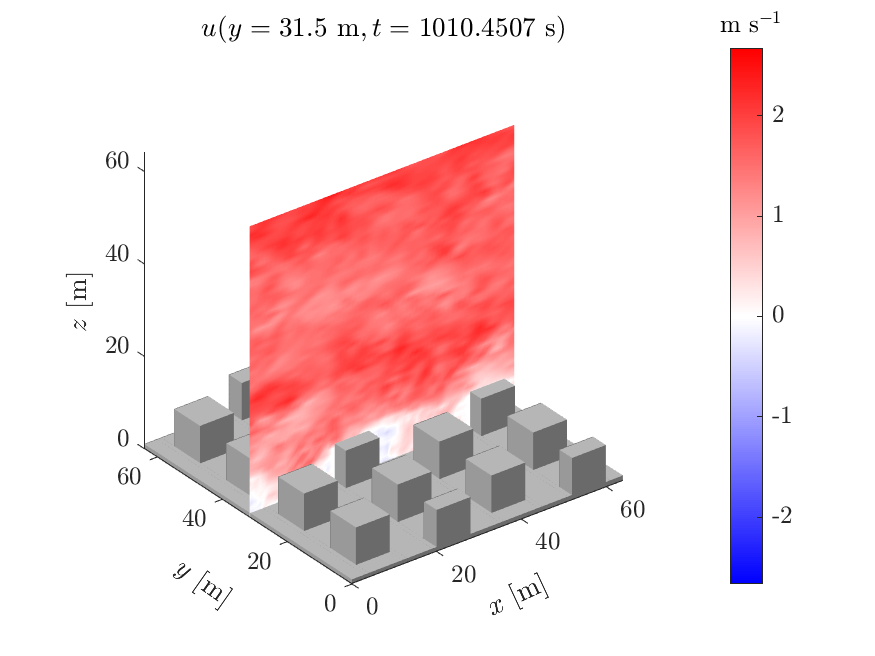

# uDALES Docs

This is the documentation for the uDALES (urban Dutch Atmospheric Large Eddy Simulation) model. It contains user's guides and general reference documentation. If you are new to uDALES, please follow our [getting started guide](udales-getting-started.md) first.

    
     

