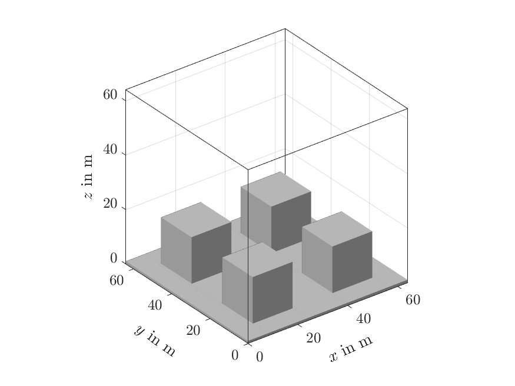
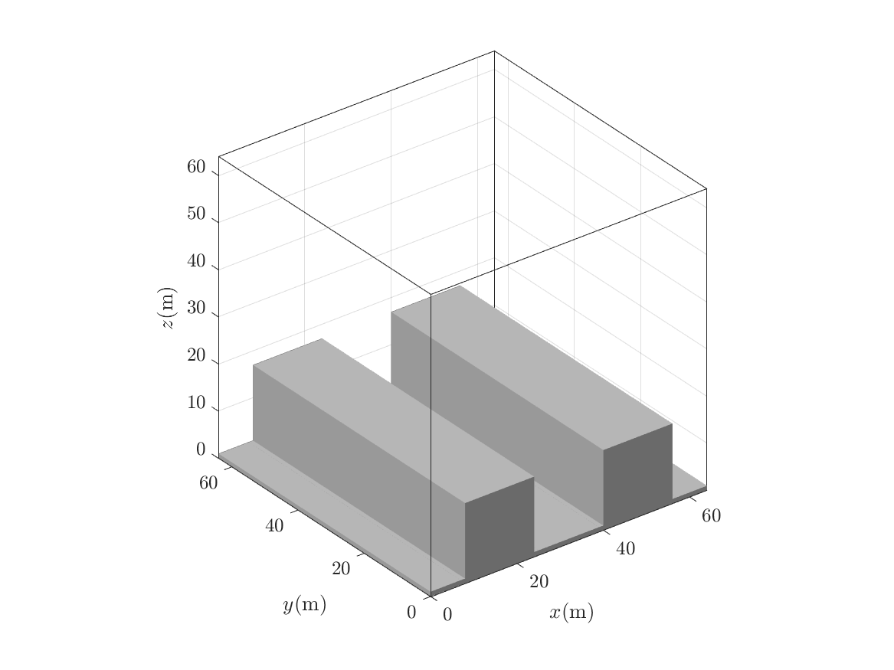
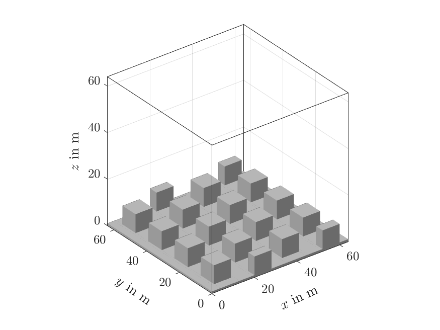
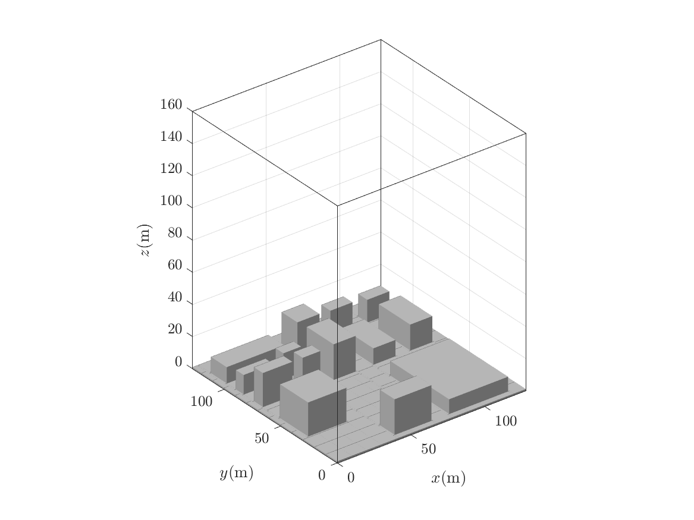
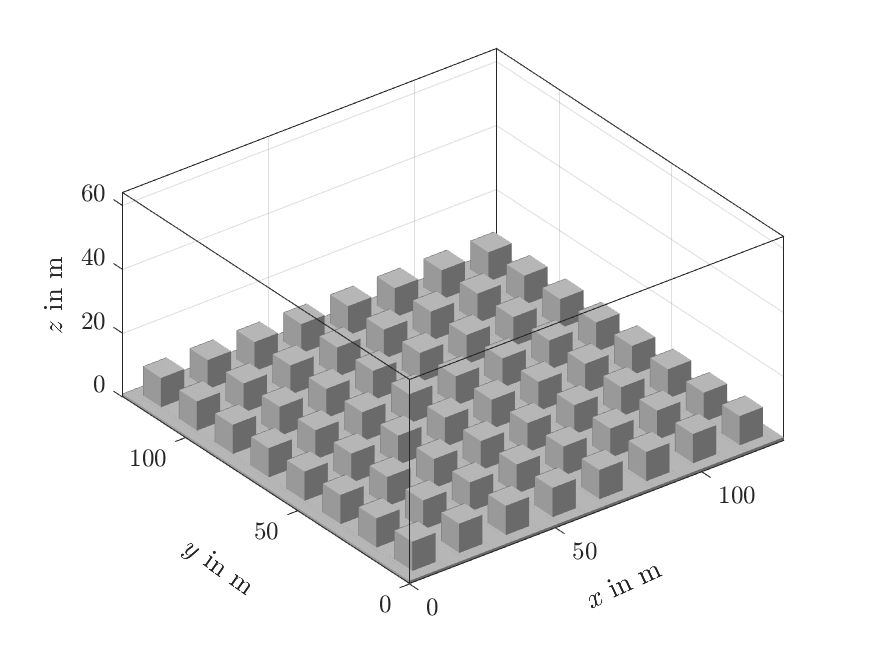

<!-- omit in toc -->
# Example simulations

uDALES simulates a large variety of urban case studies. Here we showcase a few examples ([List of examples](#list-of-examples)) with different atmospheric stabilities and various setups (overview in [Table 1](#main-simulation-set-up-options)) to help you get started. The setups are in the `namoptions` file of your simulation.

Note that we limited the simulation time to just a few minutes for demonstration, if you are looking to conduct realistic simulations, you need a much longer simulation time. If you wish to run all examples automatically and plot inputs and outputs as shown in this guide, follow the instructions detailed in the  [development notes](https://github.com/uDALES/u-dales/blob/master/DEVELOP.md) instead.

<!-- omit in toc -->
## Prerequisites

All examples below assume that you have installed uDALES as per our [getting started guide](./udales-getting-started.md).

Set up the paths and variables for running the simulation, for example with the following:

```sh
# We assume you are running the following commands from your
# top-level project directory.

export DA_TOOLSDIR=$(pwd)/u-dales/tools # Directory of scripts
export DA_BUILD=$(pwd)/u-dales/build/release/u-dales # Build file
export NCPU=2 # Number of CPUs to use for a simulation
export DA_WORKDIR=$(pwd)/outputs # Output top-level directory
```

<!-- omit in toc -->
## Run

Example cases are located under `u-dales/examples`.

All examples are run using the following command:

```sh
# We assume you are running the following commands from your
# top-level project directory.

# General syntax: local_execute.sh exp_directory
./u-dales/tools/local_execute.sh u-dales/examples/001
```

<!-- omit in toc -->
## Customising simulations

If you want to make any changes to the example simulations, e.g. changing the domain size, follow the [set-up steps](./udales-getting-started.md/#set-up) in the getting started guide to obtain a copy of the simulation setup and make the changes to your copy of the setup. You may need to run some pre-processing steps (see [Pre-processing](./udales-pre-processing.md)) before running the simulation. These cases are indicated as such in [Table 1](#main-simulation-set-up-options).

<!-- omit in toc -->
## Main simulation set-up options

Below is a list of common setups and options for urban case studies. A complete list of all options available with uDALES can be found in the [Configuration](./udales-namoptions-overview.md) document.

Table 1: Main setups of urban case studies and reference example simulation(s).

| Type                                       | Setting                             | Requires pre-processing | Example simulation           |
| ------------------------------------------ | ----------------------------------- | ----------------------- | ---------------------------- |
| Domain                                     | size and resolution                 | yes                     | all                          |
| Domain                                     | equidistant grid                    | yes                     | 001, 002, 101, 102, 501, 502 |
| Domain                                     | stretched z-grid                    | yes                     | 201                          |
| Domain                                     | warmstart                           | no                      | 102                          |
| Morphology                                 | no buildings                        | yes                     | 001                          |
| Morphology                                 | infinite canyon builings            | yes                     | 101                          |
| Morphology                                 | aligned cuboid buildings            | yes                     | 002, 501                     |
| Morphology                                 | staggered cuboid buildings          | yes                     | 102                          |
| Morphology                                 | pre-defined buildings               | yes                     | 201                          |
| Morphology                                 | LIDAR-image buildings               | yes                     | 502                          |
| Forcing                                    | pressure gradient                   | yes                     | 001                          |
| Forcing                                    | volume flow rate                    | no                      | 101, 102, 501                |
| Forcing                                    | outflow rate                        | no                      | --                           |
| Forcing                                    | free stream velocity                | no                      | --                           |
| Forcing                                    | Coriolis and nudging                | yes                     | 201                          |
| Forcing                                    | driving data                        | no                      | 502                          |
| Lateral momentum boundary conditions (BCs) | periodic                            | no                      | 001, 002, 101, 102, 201, 501 |
| Lateral momentum BCs                       | driving data                        | no                      | 502                          |
| Passive scalar source                      | point source                        | no                      | 102                          |
| Passive scalar source                      | line source                         | no                      | 101                          |
| Passive scalar source                      | source network                      | no                      | --                           |
| Lateral scalar BCs                         | periodic                            | no                      | 101, 501                     |
| Lateral scalar BCs                         | inflow-outflow                      | no                      | 102                          |
| Surface and top scalar BCs                 | zero flux                           | no                      | --                           |
| Surface and top scalar BCs                 | constant flux                       | no                      | 102                          |
| Surface and top scalar BCs                 | isothermal                          | no                      | 101, 501                     |
| Surface and top scalar BCs                 | energy balance                      | yes                     | 201                          |
| Output                                     | instantaneous fields                | no                      | 001, 101, 102, 201, 502      |
| Output                                     | time-averaged fields                | no                      | 201, 502                     |
| Output                                     | space-averaged (along y) fields     | no                      | 101                          |
| Output                                     | space-averaged (along x,y) profiles | no                      | 002, 102, 201, 501, 502      |

<!-- omit in toc -->
## List of examples

- [Standard simulation setup](#standard-simulation-setup)
- [Neutral simulations](#neutral-simulations)
  - [001](#001)
    - [No buildings, bottom surface roughness](#no-buildings-bottom-surface-roughness)
    - [Constant pressure gradient](#constant-pressure-gradient)
    - [Output: instantaneous fields](#output-instantaneous-fields)
  - [002](#002)
    - [Aligned cuboid buildings](#aligned-cuboid-buildings)
    - [Output: space-time averaged profiles](#output-space-time-averaged-profiles)
- [Non-neutral simulations](#non-neutral-simulations)
  - [101](#101)
    - [Infinite canyon buildings](#infinite-canyon-buildings)
    - [Output: space-averaged along y](#output-space-averaged-along-y)
    - [Volume flow rate forcing in x](#volume-flow-rate-forcing-in-x)
    - [Temperature](#temperature)
    - [Isothermal BC for temperature](#isothermal-bc-for-temperature)
    - [Passive scalars line source](#passive-scalars-line-source)
    - [Output: instantaneous fields for temperature and scalars](#output-instantaneous-fields-for-temperature-and-scalars)
  - [102](#102)
    - [Prerequisites for warmstart simulation](#prerequisites-for-warmstart-simulation)
    - [Staggered cuboid buildings](#staggered-cuboid-buildings)
    - [Volume flow rate forcing in x and y](#volume-flow-rate-forcing-in-x-and-y)
    - [Constant thermal flux BC for temperature](#constant-thermal-flux-bc-for-temperature)
    - [Passive scalars point source](#passive-scalars-point-source)
    - [Scalar inflow-outflow BC](#scalar-inflow-outflow-bc)
    - [Warmstart](#warmstart)
    - [Coldstart](#coldstart)
- [Energy balance simulation](#energy-balance-simulation)
  - [201](#201)
    - [Pre-defined buildings](#pre-defined-buildings)
    - [Grid-stretching in z](#grid-stretching-in-z)
    - [Output: time averaged fields](#output-time-averaged-fields)
    - [Energy Balance](#energy-balance)
    - [Moisture](#moisture)
    - [Coriolis forcing and nudging](#coriolis-forcing-and-nudging)
- [Driver simulation](#driver-simulation)
  - [501](#501)
    - [Driver/precursor simulation](#driverprecursor-simulation)
  - [502](#502)
    - [Prerequisites simulation with external forcing](#prerequisites-simulation-with-external-forcing)
    - [Buildings from LIDAR image](#buildings-from-lidar-image)
    - [Driven simulation](#driven-simulation)

## Standard simulation setup

The below setups are required for any type of simulation.
The simulation domain varies amongst the example simulations and is set-up for example by

```fortran
&DOMAIN
imax         = 64
jtot         = 64
kmax         = 64
xsize        = 64
ysize        = 64
&INPS
zsize        = 64
```

We also set an initial profile for u-wind velocity (and other variables if they are used) of e.g. u = 2 m/s by

```fortran
&INPS
u0           = 2.
```

and add some random perturbations to the initial field, such that turbulence develops faster:

```fortran
randu        = 0.01
```

Changes in the domain and initial profiles require pre-processing.

Further, we recommend running the simulations with adaptive time-stepping, the Fast-Fourier-Transformation algorithm in the poisson solver (*this will become default in the future*) and using the Vreman sub-grid model:

```fortran
&RUN
ladaptive    = .true.
&DYNAMICS
ipoiss       = 0
&NAMSUBGRID
lvreman      = .true.
```

Further information on these parameters is in the [Namoptions overview](./udales-namoptions-overview.md), and more on the required pre-processing steps is found in [Pre-processing](./udales-pre-processing.md).

## Neutral simulations

### 001

#### No buildings, bottom surface roughness

This simulation does not contain any buildings. Therefore we need to set:

```fortran
&INPS
lflat        = .true.
&WALLS
nfcts        = 0
```

A rough surface at the bottom is simulated by setting the following parameters:

```fortran
&BC
wtsurf       = 0.
wqsurf       = 0.
thls         = 288.
z0           = 0.01
z0h          = 0.000067
```

where `z0` is the roughness length for momentum. Note that even though this is a neutral simulation, all of these parameters need to be specified to reasonable values.
The simulation uses periodic lateral boundary conditions by default.

#### Constant pressure gradient

A constant pressure gradient in x is set by

```fortran
&INPS
dpdx         = 0.0001
```

#### Output: instantaneous fields

The simulation output contains the 3D instantaneous fields of u, v, and w. The output is produced after every 10 seconds of simulation runtime. We specify this by setting:

```fortran
&OUTPUT
lfielddump   = .true.
fieldvars    = 'u0,v0,w0'
tfielddump   = 10.
```


### 002



This simulation has a similar setup to `001` and additionally contains buildings.

#### Aligned cuboid buildings

The simulation contains aligned cube-shaped buildings, which can be automatically added by the pre-processing by setting:

```fortran
&INPS
lcube        = .true.
blockheight  = 16
blockwidth   = 16
canyonwidth  = 16
```

The corresponding number of blocks (including blocks on the floor) and block facets are (these are updated automatically by the preprocessing routine):

```fortran
&WALLS
nblocks      = 17
nfcts        = 33
```

#### Output: space-time averaged profiles

The simulation output contains 1D space-averaged and space-time-averaged vertical profiles. The output is produced after every 10 seconds of simulation runtime and the time-average uses a sample time step of 1 second. We specify this by setting:

```fortran
&OUTPUT
lxydump      = .true.
lxytdump     = .true.
tstatsdump   = 10.
tsample      = 1.
```

## Non-neutral simulations

### 101



#### Infinite canyon buildings

This simulation has "infinite canyons" along the y-axis as buildings. We set this by using

```fortran
&INPS
lcanyons     = .true.
blockheight  = 16
blockwidth   = 16
canyonwidth  = 16
```

#### Output: space-averaged along y

Because there is no change in building geometry along y, it makes sense to look at the 2D statistics space-averaged along the y direction (with and without time-averaging):

```fortran
&OUTPUT
lydump       = .true.
lytdump      = .true.
```

#### Volume flow rate forcing in x

The simulation is driven by a fixed volume-flow rate forcing, which prescribes the domain-average velocity of u = 1.5 m/s:

```fortran
&PHYSICS
luvolflowr   = .true.
uflowrate    = 1.5
```

#### Temperature

The simulation also considers changes in temperature. We therefore need to set

```fortran
&PHYSICS
lbuoyancy    = .true.
ltempeq      = .true.
```

set an initial temperature profile

```fortran
&INPS
thl0         = 290.
```

and specify the advection scheme for temperature:

```fortran
&DYNAMICS
iadv_thl     = 2
```

#### Isothermal BC for temperature

The temperature on the facets is set by the values in `Tfacinit.f90` (288 K in this case). These temperatures do not change as the energy balance is not used as a default (`lEB = .false.`). A fixed temperature at the the top of the domain (`tthl_top`) is set by

```fortran
&BC
thl_top      = 285.
BCtopT       = 2
```

The temperature flux between the building walls and surrounding air is determined by wall functions:

```fortran
&WALLS
iwalltemp    = 2
```

#### Passive scalars line source

A passive scalar line source is set by

```fortran
&SCALARS
nsv          = 1
lscasrcl     = .true.
SS           = 1.
sigS         = 0.5
```

and by specifying the scalar advection scheme:

```fortran
&DYNAMICS
iadv_sv      = 7
```

#### Output: instantaneous fields for temperature and scalars

We added the temperature and scalar concentration to the instantaneous fields:

```fortran
&OUTPUT
fieldvars    = 'u0,v0,w0,th,s1'
```


### 102

|                    Domain                     |                         2D output                          |                         3D output                          |
| :-------------------------------------------: | :--------------------------------------------------------: | :--------------------------------------------------------: |
|  |  |  |

The basic setup of this simulation is similar to `101`.

#### Prerequisites for warmstart simulation

The simulation is continued from a previous simulation with a similar setup. The restart files (`initd` and `inits` for scalars) containing all relevant field data is saved in the example directory.
The restart files are currently not included in the directory and can be downloaded [examples_warmstart_102.zip](https://www.dropbox.com/sh/20rsgpt0gh09gr7/AABuoCFtn6_zFTxx4k8pKqvLa?dl=1) or from the command line (Linux/macOS) with

``` sh
# From top-level project directory.

# Download required files
pushd u-dales/examples/102/
curl -o examples_warmstart_102.zip -L https://www.dropbox.com/sh/20rsgpt0gh09gr7/AABuoCFtn6_zFTxx4k8pKqvLa?dl=1
unzip examples_warmstart_102.zip
popd
```

A warmstart simulation is required to have the same basic setup as the simulation is based on, including the numbers of CPUs it is run with. The example warmstart files are run on two CPUs, therefore this simulation will also require two CPUs.
An alternative to running this simulation based on the previous output is described under [Coldstart](#Coldstart).

#### Staggered cuboid buildings

The simulation has staggered cuboid buildings, which can be set up using

```fortran
&INPS
lstaggered   = .true.
```

#### Volume flow rate forcing in x and y

The simulation is driven by a fixed volume-flow rate forcing for u and v:

```fortran
&PHYSICS
luvolflowr   = .true.
uflowrate    = 1.5
lvvolflowr   = .true.
vflowrate    = 0.3
```

#### Constant thermal flux BC for temperature

The temperature is determined by a constant thermal flux from the roads, building roofs and the top of the domain (`iwalltemp = 1` by default):

```fortran
&BC
wtsurf       = -0.01
wttop        = -0.01
bctfz        = -0.01
```

#### Passive scalars point source

The simulation contains a scalar field with a scalar point source:

```fortran
&SCALARS
lscasrc      = .true.
SS           = 1.
sigS         = 0.5
xS           = 4.
yS           = 8.
zS           = 3.
```

#### Scalar inflow-outflow BC

The scalar concentration is not determined by periodic boundary conditions like momentum and temperature, but leaves the domain at the outflow plane:

```fortran
&BC
BCxs         = 2
```

The inlet profile is determined by the profile found in `scalar.inp.102` (defaults to 0. if unspecified)

#### Warmstart

A warmstart simulation requires setting

```fortran
&RUN
lwarmstart   = .true.
startfile    = 'initd00003172_xxx.102'
```

where the name of the `startfile` needs to match the name of the restart files (xxx instead of processor number).

For a warmstart containing scalar concentration fields you need to additionally set

```fortran
&SCALARS
lreadscal    = .true.
```

#### Coldstart

This describes an alternative, if the warmstart files are not available.
Run the simulation with recommended runtime of >= 1000 s and save the restart files by setting the restart time accordingly:

```fortran
&RUN
lwarmstart   = .false.
runtime      = 1001.
trestart     = 1000.
```

Then, change the switches as described above, and make sure `startfile` matches the name of your restart files.


## Energy balance simulation

### 201



#### Pre-defined buildings

The buildings are read in by a file containing the block geometries:

```fortran
&INPS
lblocksfile  = .true.
blocksfile   = buildings.201
```

#### Grid-stretching in z

The vertical grid resolution is stretched by setting up the following parameters:

```fortran
&INPS
zsize        = 160
lzstretch    = .true.
stretchconst = 0.01
lstretchexp  = .true.
hlin         = 40
dzlin        = 1
```

`zsize` is an initial target value for the final domain height and `hlin` determines how many non-stretched grid cells there are at the lower end of the domain. Make sure to always use non-stretched grid cells wherever buildings are present. `dzlin` specifies the resolution for the non-stretched grid cells. `lstretchexp` specifies the exponential grid stretching function to be used.

#### Output: time averaged fields

We add 3D output fields that are averaged in time:

```fortran
&OUTPUT
ltdump       = .true.
```

#### Energy Balance

The simulations solves the surface energy balance.

```fortran
&ENERGYBALANCE
lEB          = .true.
lconstW      = .true.
dtEB         = 2.
bldT         = 301.0
wsoil        = 314.0
wgrmax       = 451.0
wwilt        = 172.0
wfc          = 314.0
skyLW        = 201.0
GRLAI        = 2.1
rsmin        = 200.0
```

For that we also need to use wall functions for temperature and moisture at the building facets:

```fortran
&WALLS
iwalltemp    = 2
iwallmoist   = 2
```

#### Moisture

The energybalance contains a latent heat flux and therefore we need to solve the full wet thermodynamics including moisture:

```fortran
&PHYSICS
lmoist       = .true.
```

The advection scheme for moisture is specified by:

```fortran
&DYNAMICS
iadv_qt      = 2
```

and domain top- values are chosen:

```fortran
&BC
qt_top       = 0.0
```

#### Coriolis forcing and nudging

A coriolis force is specified:

```fortran
&PHYSICS
lcoriol      = .true.
```

The geostrophic velocity is defined by default as a uniform profile of the initial velocity:

```fortran
&INPS
u0           = 1.5
```

Nudging is applied in the top 64 cells of the domain with a relaxation timescale of 10800 seconds:

```fortran
&PHYSICS
lnudge       = .true.
tnudge       = 10800.
nnudge       = 64
```


## Driver simulation

### 501



This simulation is similar to `101` but does not contain any scalars. It is used as the precursor simulation for simulation `502`.

#### Driver/precursor simulation

To save the output of a simulation into files that can be read by another simulation as driver-inputs, we set:

```fortran
&DRIVER
idriver      = 1
tdriverstart = 0
dtdriver     = 0.15
driverstore  = 201
iplane       = 128
```

`iplane` sets the index of the y-z plane we store (here this is equal to the outlet plane), and `(driverstore-1)*dtdriver` determines for how long you can run the driven simulation. The time when we start recording the planes should therefore be `tdriverstart` <= `runtime` - `(driverstore-1)*dtdriver`. More information on these parameters is in the documentation on [simulation setup](./udales-simulation-setup.md).


### 502

#### Prerequisites simulation with external forcing

The driver input files are currently not included in the directory and can be downloaded [examples_driver_501.zip](https://www.dropbox.com/sh/spld3hqipqe17j1/AAA0cuzW3qc9ftY6dvHcSSL8a?dl=1) or from the command line (Linux/macOS) with

``` sh
# From top-level project directory.

# Download required files
pushd u-dales/examples/502/
curl -o examples_driver_501.zip -L https://www.dropbox.com/sh/spld3hqipqe17j1/AAA0cuzW3qc9ftY6dvHcSSL8a?dl=1
unzip examples_driver_501.zip
popd
```

These `*driver*` files need to be in the same place as the other input files. Alternatively, the `*driver*` files from simulation 501 can be used by copying them into the directory of 502. For that we recommend to set the `runtime` to at least 1000 s, and `tdriverstart` accordingly with `tdriverstart` <= `runtime` - `(driverstore-1)*dtdriver`.

#### Buildings from LIDAR image

The buildings of this simulation are generated from a grey-scale image of the buildings and their heights.

```fortran
&INPS
llidar       = .true.
sourcename   = DAPPLE7.png
dxinp        = 1
dyinp        = 1
dzinp        = 1
centeri      = 400
centerj      = 400
maxh         = 25
pad          = 3
smallarea    = 150
```

#### Driven simulation

This simulation is forced by the data from the stored outlet plane of simulation `501`:

```fortran
&DRIVER
idriver      = 2
driverjobnr  = 501
driverstore  = 201
```

The runtime of this simulation is restricted by the simulation time of the driver output, which is `(driverstore-1)*dtdriver` of the precursor simulation `501`. The maximum runtime we can set is therefore

```fortran
runtime      = 30.
dtmax        = 0.15
```

and we want to set `dtmax` = `dtdriver` (`501`) to avoid interpolation of the driver snapshots.

All boundary conditions (momentum, temperature) are set to inflow-outflow by:

```fortran
&BC
BCxm         = 5
```

for which we will also need to use the cyclic reduction scheme of the poisson solver:

```fortran
&DYNAMICS
ipoiss       = 1
```
