# Working with uDALES facet data in MATLAB


In this tutorial we cover how to work with uDALES facet data. This pertains to all surface quanties, e.g. shear stress, surface pressure, surface energy balance terms and the temperature inside each of the facets.


The **`udbase`** post-processing class reads in most important input parameters, and contains a number of methods to work with facet data:


   -  [**calculate_frontal_properties**](#calculate_frontal_properties-calculate-skyline-blockage-ratio-and-frontal-areas). This method calculates the skylines, frontal areas and blockage ratios in the x- and y-direction. 
   -  [**plot_fac_type**](#plot_fac_type-display-surface-types). This method displays the type of surface for each facet. 
   -  [**assign_prop_to_fac**](#assign_prop_to_fac-assigning-wall-properties-to-facets). This method assigns a property of the facet type to each of the facets, so it can be used for calculation and visualisation 
   -  [**plot_fac**](#plot_fac-plot-facet-quantities). This method displays a surface variable on the surface mesh. 
   -  [**load_fac_momentum**](#load_fac_momentum-load-facet-pressure-and-shear-stresses). This method loads instantaneous momentum surface data from `fac.expnr.nc`. The first index is the facet id and second index is time. 
   -  [**load_fac_eb**](#load_fac_eb-load-term-from-the-surface-energy-balance). This method loads instantaneous surface energy balance data from `facEB.expnr.nc`. The first index is the facet id and second index is time. 
   -  [**load_seb**](#load_seb-load-all-surface-energy-balance-terms). This method loads all instantaneous surface energy balance terms. The first index is the facet id and second index is time. 
   -  [**load_fac_temperature**](#load_fac_temperature-load-temperatures-inside-facets). This method loads instantaneous facet temperature data `facT.expnr.nc`. The first index is the facet id, the second is the layer index and the third index is time. 
   -  [**area_average_seb**](#area_average_seb-perform-area-averaging-of-the-surface-energy-balance-terms). This method calculates the area-averaged surface energy balance from the facet surface energy balances obtained using `load_seb`. 
   -  [**area_average_fac**](#area_average_fac-area-averaging-over-facet-data). This method performs area-averaging over (a selection of) the facets. The facet index is assumed to be the first index of the array. 
   -  [**time_average**](#time_average-a-method-to-time-average-data). This method performs time-averaging on an array; where time is assumed to be the last index of the array. 
   -  [**convert_fac_to_field**](#convert_fac_to_field-convert-facet-data-to-3d-density-field). This method converts a facet variable to a density in a 3D field, so it can be used for post-processing (e.g. calculating distributed drag). 


**The live matlab file of this tutorial can be found in the repository in the folder /docs/tutorial_mlx.**


# Initialising udbase


The starting point of this tutorial is that you have run a simulation and have merged the output files. If the simulations were performed on a HPC system, **we assume that you have copied the output directory to your own workstation**. Some of the netCDF (*.nc) files may be very large and you may only want to copy these if you plan to analyse the data.


**Note that the uDALES/tools/matlab path must be added via the Set Path button in order to use the udbase class. Alternatively, it can be added using the addpath function inside the script (done here).**


```matlab

% preamble
clear variables
close all

% add the uDALES matlab path
addpath('../matlab')

% create an instance of the udbase class
expnr = 065;
expdir = '../experiments/065';
sim = udbase(expnr, expdir);
```

# calculate_frontal_properties: calculate skyline, blockage ratio and frontal areas

```matlab
help sim.calculate_frontal_properties;
```


```text
--- help for udbase/calculate_frontal_properties ---

  A method to calculate the skyline, frontal areas and blockage
  ratios in the x- and y-direction. 
 
  res = calculate_frontal_properties(OBJ) executes the method
                                and returns a structure with
                                the skyline, frontal areas and
                                blockage ratios in x- and
                                y-direction. 
  Example:
    res = obj.calculate_frontal_properties();
```


This method calculates the frontal areas and blockage ratios in the x- and y-direction. Here, the frontal area represents the surface area projected *summed over each individual building* in the domain. In order to calculate the blockage ratio, we first calculate the skyline (see below in black) and determine the fraction of the image that is not occupied by fluid (white). 


```matlab
res = sim.calculate_frontal_properties();
```


```text
x-direction: frontal area = 368.0 m2, blockage ratio = 0.090
y-direction: frontal area = 208.0 m2, blockage ratio = 0.051
```


```matlab
res
```


```text
res = struct with fields:
    skylinex: [64x64 double]
    skyliney: [64x64 double]
         Afx: 368
         Afy: 208
         brx: 0.0898
         bry: 0.0508

```


Let's plot the skyline in the x- and y-direction


```matlab
figure
subplot(1,2,1)
pcolor(sim.yt, sim.zt, res.skylinex')
shading flat
colormap(flipud(colormap('gray')))
xlabel('y [m]','Interpreter','latex')
ylabel('z [m]','Interpreter','latex')
ax = gca;
ax.TickLabelInterpreter = 'latex';
axis equal tight
title('skyline in x-direction')

subplot(1,2,2)
pcolor(sim.xt, sim.zt, res.skyliney')
shading flat
colormap(flipud(colormap('gray')))
xlabel('x [m]','Interpreter','latex')
ylabel('z [m]','Interpreter','latex')
axis equal tight
ax = gca;
ax.TickLabelInterpreter = 'latex';
title('skyline in y-direction')
```


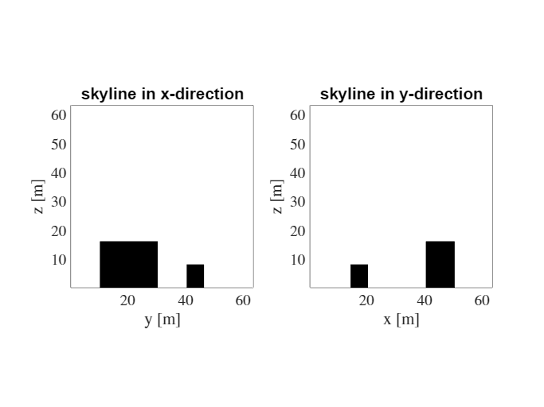


```matlab

```

# plot_fac_type: display surface types

```matlab
help sim.plot_fac_type
```


```text
--- help for udbase/plot_fac_type ---

  A method for plotting the different surface types used in a
  geometry.
 
  plot_fac_types(OBJ) plots the surface types 
 
  Example:
    obj.plot_fac_type();
```


When working with a surface energy balance model, each facet will have a specific wall type with its own properties (albedo, emissivity, thickness etc). The wall types of the geometry can be conveniently displayed using the method `plot_fac_type`:


```matlab
figure
sim.plot_fac_type()
format_surface_plot('')
colorbar off
```


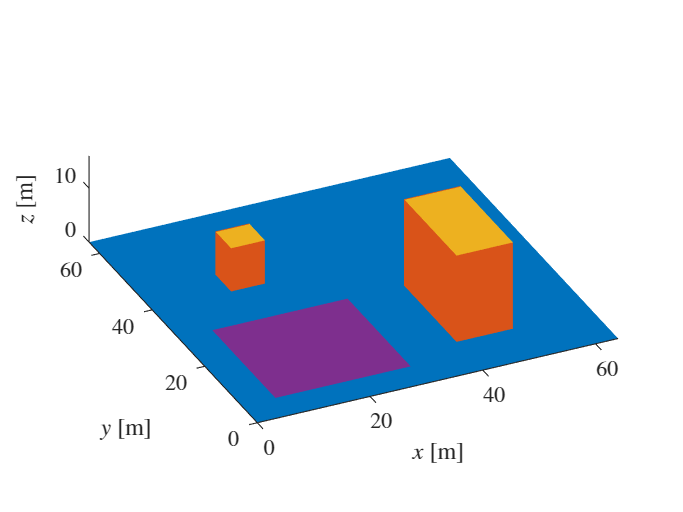


The function `format_surface_plot` applies a consistent layout to the surface plots. Its implementation is given at the end of the tutorial. 


# assign_prop_to_fac: assigning wall properties to facets

```matlab
help sim.assign_prop_to_fac
```


```text
--- help for udbase/assign_prop_to_fac ---

  Method for assigning properties of a material (stored in
  factypes) to each facet for visualisation or calculation..   
 
  assign_prop_to_fac(OBJ, strprop) assigns the property strprop
                                   to the appropriate facet.
 
  Example (assign albedo to each facet):
    obj = udbase(expnr);
    al = obj.assign_prop_to_fac('al');
```


The wall type of each facet assigns properties to it which are stored in the `factypes` structure.


```matlab
sim.factypes
```


```text
ans = struct with fields:
      id: [9x1 double]
    name: {9x1 cell}
     lGR: [9x1 double]
      z0: [9x1 double]
     z0h: [9x1 double]
      al: [9x1 double]
      em: [9x1 double]
       d: [9x5 double]
       C: [9x5 double]
     lam: [9x6 double]

```


Description:


   -  `id`: type identifier 
   -  `name`: type name 
   -  `lGR`: boolean that indicates whether or not there is evaporation on the facet 
   -  `z0`: [m] momentum roughness length for wall-function 
   -  `z0h`: [m] heat roughness length for wall-function 
   -  `al`: [-] surface albedo 
   -  `em`: [-] surface emissivity 
   -  `d`: [m] thickness of each layer inside the facet 
   -  `C`: [J/m3K] volumetric heat capacity of each layer inside the facet. 
   -  `lam`: [W/mK] thermal conductivity on each cell face inside the facet. 


In order to assign these properties to each facet, use the method `assign_prop_to_fac`. For example, to assign the albedo to each surface facet:


```matlab
albs = sim.assign_prop_to_fac('al');
```

# plot_fac: plot facet quantities

```matlab
help sim.plot_fac
```


```text
--- help for udbase/plot_fac ---

  A method for plotting a facet variable var as a 3D surface
 
  plot_fac(OBJ, var) plots variable var
 
  Example (plot net shortwave radiation):
    obj.plot_fac(K);
```


We can now plot the albedo using the method `plot_fac`.


```matlab
figure
sim.plot_fac(albs)
format_surface_plot('$\alpha$ [-]')
```


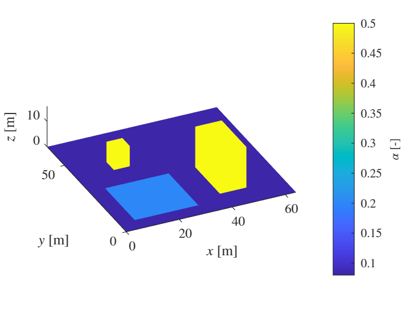

# load_fac_momentum: load facet pressure and shear stresses

```matlab
help sim.load_fac_momentum
```


```text
--- help for udbase/load_fac_momentum ---

  A method to retrieve facet data for pressure and shear
  information from the fac file.  
 
  load_fac_momentum(OBJ) displays the variables in the file
 
  load_fac_momentum(OBJ, svar) retrieves a variable from the file
 
  Example (view contents of output):
    obj = udbase(expnr);
    obj.load_fac_momentum();
```


Surface information about shear and pressure can be obtained using the method `load_fac_momentum`. Calling it without parameters shows the data inside the file:


```matlab
sim.load_fac_momentum;
```


```text
Contents of fac.065.nc:
    Name               Description              Units      Size       Dimensions
    _____    _______________________________    _____    _________    __________

    cth      heat transfer coefficient (Ivo)             2658x1000    fct, time 
    fct      Facet number                                2658         fct       
    htc      heat transfer coefficient                   2658x1000    fct, time 
    pres     pressure                            Pa      2658x1000    fct, time 
    t        Time                                s       1000         time      
    tau_x    tau_x                               Pa      2658x1000    fct, time 
    tau_y    tau_y                               Pa      2658x1000    fct, time 
    tau_z    tau_z                               Pa      2658x1000    fct, time 
```


Now we load the pressure data using the `load_fac_momentum` method and visualise it using the `plot_fac` method.


```matlab
pres = sim.load_fac_momentum('pres');

figure
sim.plot_fac(pres(:,end))
format_surface_plot('$p$ [m$^{2}$s$^{-2}$]')
```


# load_fac_eb: load term from the surface energy balance

```matlab
help sim.load_fac_eb
```


```text
--- help for udbase/load_fac_eb ---

  A method to retrieve facet data of a surface energy balance
  term from the facEB file.   
 
  load_fac_eb(OBJ) displays the variables in the file
 
  load_fac_eb(OBJ, svar) retrieves a variable from the file
 
  Example (view contents of output):
    obj = udbase(expnr);
    obj.load_fac_eb();
```


l`oad_fac_eb` is a low-level routine that reads individual variables from the surface energy balance file `facEB.expnr.nc`. It is recommended to use the method `load_seb` which loads all surface energy balance terms at the same time.


The variables in `facEB.expnr.nc` are: 


```matlab
sim.load_fac_eb();
```


```text
Contents of facEB.065.nc:
    Name        Description       Units       Size       Dimensions
    _____    _________________    _____    __________    __________

    LWin     Incoming longwave    W/m^2    2658x10020    fct, time 
    LWout    Outgoing longwave    W/m^2    2658x10020    fct, time 
    WGR      Water content        ?        2658x10020    fct, time 
    ef       Latent heat          W/m^2    2658x10020    fct, time 
    fct      Facet number                  2658          fct       
    hf       Sensible heat        W/m^2    2658x10020    fct, time 
    netsw    Net shortwave        W/m^2    2658x10020    fct, time 
    t        Time                 s        10020         time      
```


Let's load and plot the net shortwave radiation at the end time


```matlab
Kstar = sim.load_fac_eb('netsw');

figure
sim.plot_fac(Kstar(:,end))
format_surface_plot('$K^*$ [Wm$^{-2}$]')
```


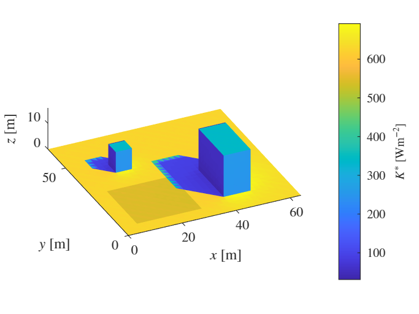

# load_seb: load all surface energy balance terms

```matlab
help sim.load_seb
```


```text
--- help for udbase/load_seb ---

  A method to retrieve all surface energy balance terms on each
  of the facets as a function of time. 
 
  load_seb(OBJ) loads the terms in the surface energy balance.
 
  Example:
    obj = udbase(expnr);
    obj.load_seb();
```


the method `load_seb` loads all energy balance terms including surface temperature at once and is the preferred way of working with terms in the surface energy balance.


```matlab
seb = sim.load_seb()
```


```text
seb = struct with fields:
    Kstar: [2658x10020 single]
    Lstar: [2658x10020 single]
      Lin: [2658x10020 single]
     Lout: [2658x10020 single]
        H: [2658x10020 single]
        E: [2658x10020 single]
        G: [2658x10020 single]
    Tsurf: [2658x10020 single]
        t: [10020x1 single]

```


Let's plot all components of the surface energy balance at the last timestep


```matlab
figure
subplot(3,2,1)
sim.plot_fac(seb.Kstar(:,end))
format_surface_plot('$K^*$ [Wm$^{-2}$]')
subplot(3,2,2)
sim.plot_fac(seb.Lstar(:,end))
format_surface_plot('$L^*$ [Wm$^{-2}$]')
subplot(3,2,3)
sim.plot_fac(seb.H(:,end))
format_surface_plot('$H$ [Wm$^{-2}$]')
subplot(3,2,4)
sim.plot_fac(seb.E(:,end))
format_surface_plot('$E$ [Wm$^{-2}$]')
subplot(3,2,5)
sim.plot_fac(seb.G(:,end))
format_surface_plot('$G$ [Wm$^{-2}$]')
subplot(3,2,6)
sim.plot_fac(seb.Tsurf(:,end))
format_surface_plot('$T_{surf}$ [K]')
```


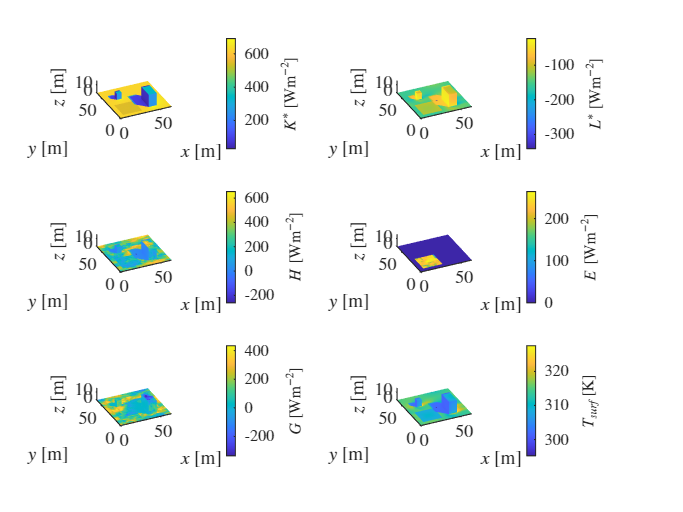

# load_fac_temperature: load temperatures inside facets

```matlab
help sim.load_fac_temperature
```


```text
--- help for udbase/load_fac_temperature ---

  A method to retrieve temperature and temperature gradient
  data from the facT file.   
 
  load_fac_temperature(OBJ) displays the variables in the file
 
  load_fac_temperature(OBJ, svar) retrieves a variable from the file
 
  Example (view contents of output):
    obj = udbase(expnr);
    obj.load_fac_temperature();
```


The following information is available about the temperature inside facets:


```matlab
sim.load_fac_temperature();
```


```text
Contents of facT.065.nc:
    Name         Description         Units        Size          Dimensions  
    ____    _____________________    _____    ____________    ______________

    T       Temperature               K       2658x6x10020    fct, lyr, time
    dTdz    Temperature gradient      K/m     2658x6x10020    fct, lyr, time
    fct     Facet number                      2658            fct           
    lyr     Number of wall layers             6               lyr           
    t       Time                      s       10020           time          
```


This data can be used to explore what goes on inside each facet. As an example, let's plot the time-evolution of temperature inside facet 1:


```matlab
% load time, temperature data and layer thicknesses
t = sim.load_fac_temperature('t');
T = sim.load_fac_temperature('T');
d = sim.assign_prop_to_fac('d'); % retrieve facet layer thicknesses

facid = 1;
tsel = t(1:1000:end);
Tsel = squeeze(T(facid, :, 1:1000:end));
x = [0, cumsum(d(facid, :))]; % temperature is defined on cell faces

figure
hold on
leg = cell(size(tsel));
for n = 1:length(tsel)
    plot(x, Tsel(:, n), 'LineWidth', 1)
    leg{n} = ['$t=', num2str(tsel(n), '%8.0f'), '$ s'];
end
l = legend(leg);
box on
l.Interpreter = 'latex';
xlabel('$x$ [m]','Interpreter','latex')
ylabel('$T$ [K]','Interpreter','latex')
ax = gca;
ax.TickLabelInterpreter = 'latex';
title('Temperature inside facet 1')
```


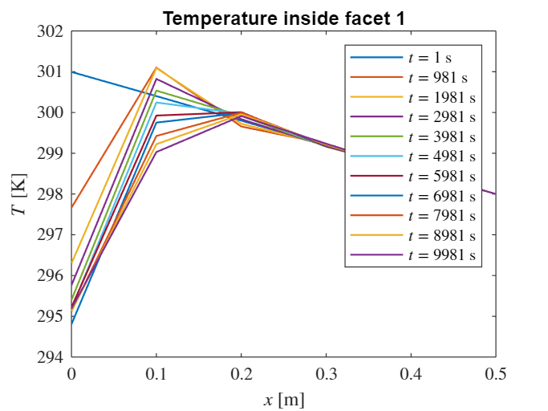

# area_average_seb: perform area-averaging of the surface energy balance terms

```matlab
help sim.area_average_seb
```


```text
--- help for udbase/area_average_seb ---

  A method for calculating the area-averaged surface energy
  balance.
 
  area_average_seb(OBJ, seb) averages the variables in seb over the
  area.
 
  Example:
    obj = udbase(expnr);
    seb = obj.load_seb()
    seb_av = obj.area_average_seb(seb);
```


This method converts the facet-by-facet surface energy balance to an area-averaged surface energy balance.


```matlab
seb_av = sim.area_average_seb(seb)
```


```text
seb_av = struct with fields:
    Kstar: [461.2403 461.2403 461.2403 461.2403 461.2403 461.2403 461.2403 461.2403 461.2403 461.2403 461.2147 461.2147 461.2147 461.2147 461.2147 461.2147 461.2147 461.2147 461.2147 461.2147 461.2147 461.2147 461.2147 461.2147 … ] (1x10020 single)
    Lstar: [-61.3138 -61.3469 -61.3852 -61.4188 -61.4530 -61.4909 -61.5253 -61.5605 -61.5961 -61.6331 -61.3138 -61.3469 -61.3852 -61.4188 -61.4530 -61.4909 -61.5252 -61.5604 -61.5961 -61.6331 -61.3138 -61.3469 -61.3852 -61.4188 … ] (1x10020 single)
      Lin: [373.6797 373.6832 373.6863 373.6898 373.6931 373.6962 373.6998 373.7029 373.7063 373.7097 373.6797 373.6832 373.6863 373.6898 373.6931 373.6962 373.6998 373.7029 373.7063 373.7096 373.6797 373.6832 373.6863 373.6898 … ] (1x10020 single)
     Lout: [434.9932 435.0301 435.0715 435.1083 435.1460 435.1872 435.2253 435.2637 435.3025 435.3427 434.9932 435.0299 435.0714 435.1081 435.1460 435.1872 435.2255 435.2637 435.3022 435.3427 434.9932 435.0299 435.0714 435.1081 … ] (1x10020 single)
        H: [0.7807 3.6902 7.5545 10.5529 11.8296 11.1453 10.0029 9.9542 10.1124 10.3147 0.7807 3.6902 7.5545 10.5530 11.8298 11.1455 10.0029 9.9541 10.1123 10.3149 0.7807 3.6902 7.5545 10.5530 11.8298 11.1455 10.0029 9.9541 10.1123 … ] (1x10020 single)
        E: [25.9738 16.7287 16.5153 16.3215 16.1434 15.9498 15.7488 15.5422 15.2622 15.0522 25.9738 16.7313 16.5179 16.3240 16.1458 15.9522 15.7511 15.5444 15.2642 15.0543 25.9738 16.7313 16.5179 16.3240 16.1458 15.9522 15.7511 … ] (1x10020 single)
        G: [373.2034 379.5020 375.8164 372.9749 371.8422 372.6852 373.9917 374.2121 374.2988 374.2705 373.1778 379.4739 375.7881 372.9467 371.8143 372.6568 373.9637 374.1846 374.2715 374.2426 373.1778 379.4739 375.7881 372.9467 … ] (1x10020 single)
        t: [10020x1 single]

```


Check that the surface energy balance terms sum to zero:


```matlab
max(abs(seb_av.Kstar+seb_av.Lstar-seb_av.H-seb_av.E-seb_av.G))
```


```text
ans = single0.0313
```


This value is very small compared to the mean incoming short-wave radiation on the facets (\textasciitilde{}400 W/m2) and we therefore conclude that the surface energy balance closes. We now create a plot of the area-averaged surface energy balance.


```matlab
figure()
hold on
plot(seb_av.t,seb_av.Kstar, seb_av.t,seb_av.Lstar, seb_av.t,seb_av.H, ...
     seb_av.t,seb_av.E, seb_av.t,seb_av.G, 'LineWidth',1);
xlim([0,seb_av.t(end)])
l = legend('$K^*$','$L^*$','$H$','$E$','$G$');
box on
l.Interpreter = 'latex';
xlabel('$t$ [s]','Interpreter','latex')
ylabel('$\langle F \rangle_s$ [Wm$^{-2}$]','Interpreter','latex')
ax = gca;
ax.TickLabelInterpreter = 'latex';
title('Area-averaged surface energy balance')
```


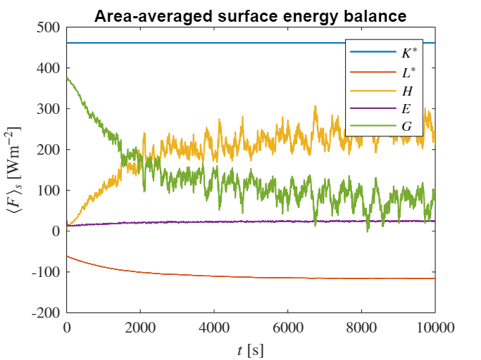


Note that this is an average over the surface. In order to obtain the surface energy balances typically used in meteorology, we will need to project this onto a flat ground using a factor $f=A_{3D} /A_{2D}$, where $A_{3D}$ is the total surface area and $A_{2D}$ is the projected surface area (height x width of the domain).


```matlab
% Define a factor f = A3D/A2D. 
f = sum(sim.facs.area)/(sim.xlen*sim.ylen);

% Upon multiplying the area-averaged SEB with f, the SEB represents a
% projected-area-averaged SEB term as typically presented in meteorological
% applications.  

figure()
hold on
plot(seb_av.t,f*seb_av.Kstar, seb_av.t,f*seb_av.Lstar, seb_av.t,f*seb_av.H, ...
     seb_av.t,f*seb_av.E, seb_av.t,f*seb_av.G, 'LineWidth',1);
xlim([0,seb_av.t(end)])
l = legend('$K^*$','$L^*$','$H$','$E$','$G$');
box on
l.Interpreter = 'latex';
xlabel('$t$ [s]','Interpreter','latex')
ylabel('$F$ [Wm$^{-2}$]','Interpreter','latex')
ax = gca;
ax.TickLabelInterpreter = 'latex';
title('Standard surface energy balance')
```


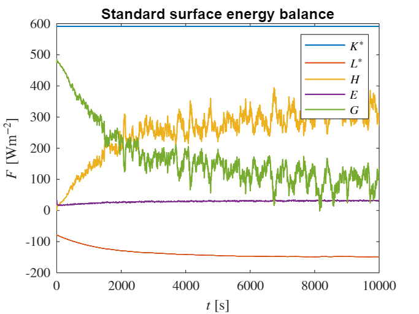


 


# area_average_fac: area-averaging over facet data

```matlab
help sim.area_average_fac;
```


```text
--- help for udbase/area_average_fac ---

  A method for area-averaging a facet quantity, either over all
  facets or over a selection.  
 
  area_average_fac(OBJ, var) area-averages variable var over
  all facets.
 
  area_average_fac(OBJ, var, sel) area-averages variable var
  over the facet indices in sel
 
  Example:
    K_av = obj.area_average_fac(K);
```


This method performs area-averaging, either over all facets or over a selection of facets.


Below we provide a non-trivial example on how to this method can be used to obtain a surface energy balance for the sidewalls in the domain. The sidewalls will be selected by using that the z-component of the surface normal has to be zero:


```matlab
% Select side walls
norms = sim.geom.stl.faceNormal;
fac_ids = find(abs(norms(:, 3)) < 1e-6);

% a quick visual check
I = zeros(size(sim.facs.area));
I(fac_ids) = 1;

figure
sim.plot_fac(I)
format_surface_plot('')
```


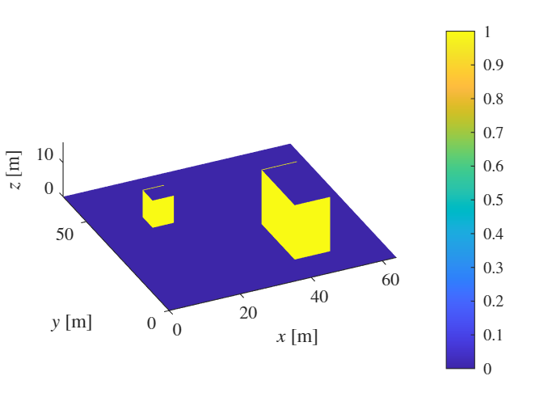


This looks correct. We can now calculate and plot the area-averaged surface energy balance on the side-walls.


```matlab
Kav_side = sim.area_average_fac(seb.Kstar, fac_ids);
Lav_side = sim.area_average_fac(seb.Lstar, fac_ids);
Hav_side = sim.area_average_fac(seb.H, fac_ids);
Eav_side = sim.area_average_fac(seb.E, fac_ids);
Gav_side = sim.area_average_fac(seb.G, fac_ids);

figure()
hold on
plot(seb.t,Kav_side, seb.t,Lav_side, seb.t,Hav_side, ...
     seb.t,Eav_side, seb.t,Gav_side, 'LineWidth',1);
xlim([0,seb_av.t(end)])
l = legend('$K^*$','$L^*$','$H$','$E$','$G$');
box on
l.Interpreter = 'latex';
xlabel('$t$ [s]','Interpreter','latex')
ylabel('$\langle F \rangle_s$ [Wm$^{-2}$]','Interpreter','latex')
ax = gca;
ax.TickLabelInterpreter = 'latex';
title('Area-averaged surface energy balance for sidewalls')
```


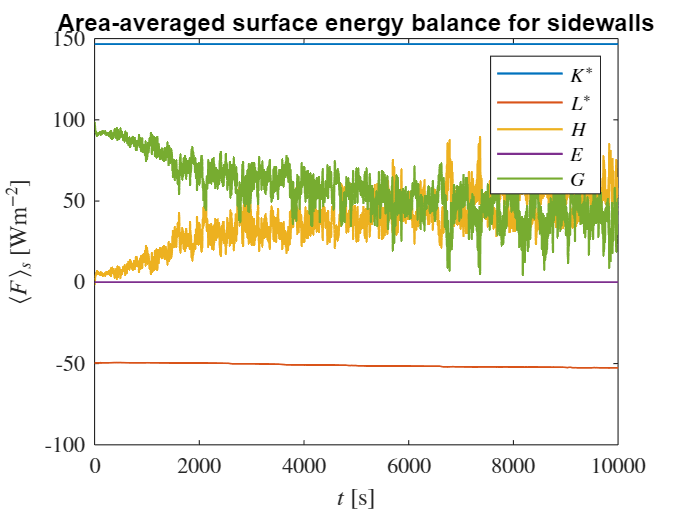

# time_average: a method to time-average data

```matlab
help udbase.time_average
```


```text
  A method for averaging facet variables in time. The time
  index is assumed to be the last index of the array.
```


This static method performs time-averaging. As an example we average the sensible heat flux across the whole time using the `time_average` method. This method can also accept `tstart` and `tstop` which specify the time range over which to average. 


```matlab
% average over entire time-range
Havt = udbase.time_average(seb.H,seb.t);

figure
subplot(1,2,1)
sim.plot_fac(Havt)
format_surface_plot('$H$ [Wm$^{-2}$]')
colorbar off
% average over second half of the time-range
tstart = seb.t(end)/2;
tstop = seb.t(end);
Havt = udbase.time_average(seb.H,seb.t,tstart,tstop);
subplot(1,2,2)
sim.plot_fac(Havt)
format_surface_plot('$H$ [Wm$^{-2}$]')
colorbar off
```


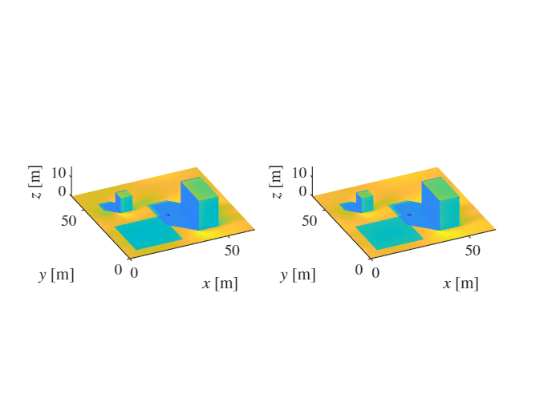

# convert_fac_to_field: convert facet data to 3D density field

```matlab
help sim.convert_fac_to_field
```


```text
--- help for udbase/convert_fac_to_field ---

  Method for converting a facet variable to a density in a 3D
  field. 
 
  convert_fac_to_field(OBJ, var) converts the facet variable var  
                                 to a 3D field density.   
 
  Example:
    fld = obj.convert_fac_to_field(var);
```


This function assigns facet data to a density in a 3D field, which is useful for assessing plane-average distributed stresses [1] as well as the multi-scale analysis proposed by Van Reeuwijk and Huang [2]. For example, we can convert the time-averaged heat flux Havt to a 3d density field as follows.


```matlab
rhoH = sim.convert_fac_to_field(Havt,sim.facsec.c,sim.dzt);

% let's check whether the integrals of the 2D and 3D fields match:
s = 0;
for k = 1:size(rhoH, 3)
    s = s + sum(sum(rhoH(:,:,k)*sim.dx*sim.dy*sim.dzt(k)));
end

% calculate the relative error
abs(s - sum(Havt .* sim.facs.area)) / s
```


```text
ans = single1.0074e-07
```


The relative error is extremely small which shows that the total amount of heat added to the domain is equivalent in both cases. Let's visualise the density field:


```matlab
% Get the (x, y, z) coordinates of non-zero elements
[i, j, k] = ind2sub(size(rhoH), find(abs(rhoH) > 0));
x = sim.xt(i); y = sim.yt(j); z = sim.zt(k);

% Get the corresponding values
values = rhoH(abs(rhoH) > 0);

% Plot the data using scatter3
figure;
scatter3(x, y, z, 24, values, 'filled');
format_surface_plot('$\rho_{H}$ [Wm$^{-3}$]');
```


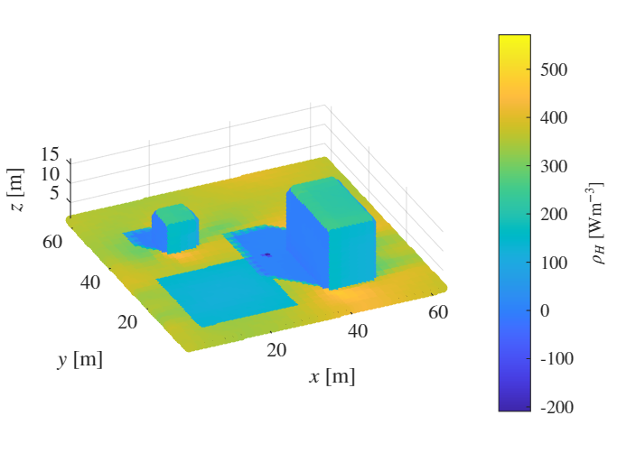


Here, we note that it is a coincidence that the values of the sensible heat flux density $\rho_{H\;}$ are similar to those of the heat flux $\bar{H\;}$itself, despite their units being different. 


To calculate the horizontally-average heat flux density, we can simply average over the horizontal directions.


```matlab
fH = squeeze(mean(mean(rhoH, 1), 2));
figure
plot(fH, sim.zt, 'LineWidth',1);
box on
ylabel('$z$ [m]','Interpreter','latex')
xlabel('$f_H$ [Wm$^{-3}$]','Interpreter','latex')
ax = gca;
ax.TickLabelInterpreter = 'latex';
title('Distributed heat flux')
```


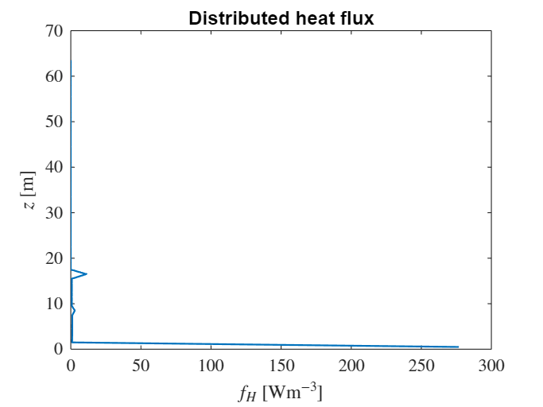

# Function to format surface plots


This auxiliary function is used to ensure a consistent layout of all surface plots in this tutorial.


```matlab
function format_surface_plot(strvar)
view(-25,30)
xlabel('$x$ [m]','Interpreter','latex')
ylabel('$y$ [m]', 'Interpreter','latex')
zlabel('$z$ [m]','Interpreter','latex')
ax = gca;
ax.TickLabelInterpreter = 'latex';
%view(3)
axis equal
c=colorbar;
c.Label.String = strvar;
c.Label.Interpreter = 'latex';
c.TickLabelInterpreter = 'latex';
end
```

# References


[1] Suetzl BS, Rooney GG,  van Reeuwijk M (2020). Drag Distribution in Idealized Heterogeneous Urban Environments. *Bound-Lay. Met.* **178**, 225-248.


[2] van Reeuwijk M, Huang J. Multi-scale analysis of flow over heterogeneous urban surfaces. *Bound-Lay. Met*. (under review).


