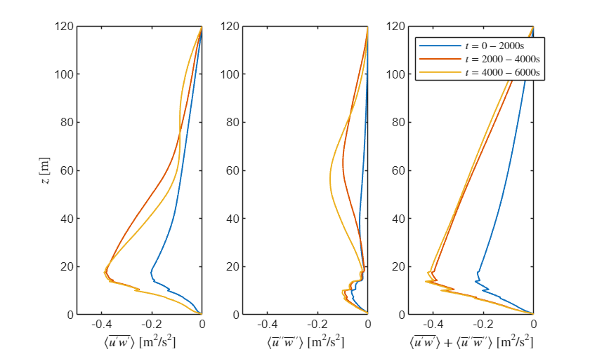
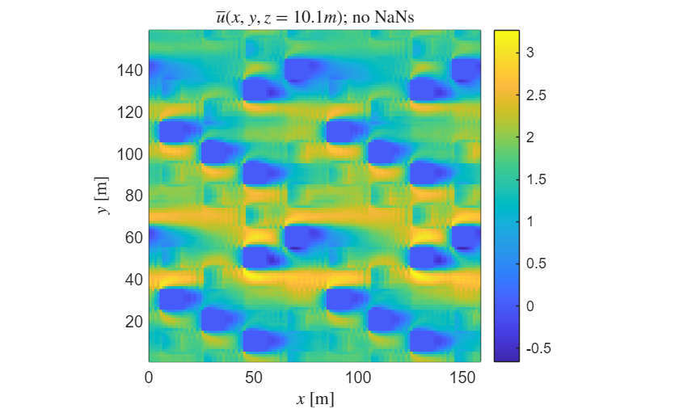
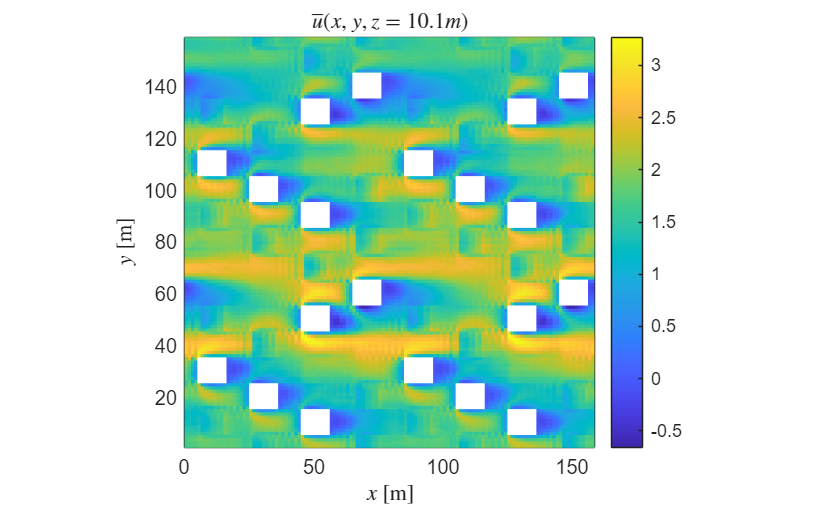

# Working with uDALES field data in MATLAB
This tutorial describes how to read and process field data output of the LES code uDALES using MATLAB. In addition, it describes some important concepts, such as the [grid layout](#H_7AB386AF), [variable locations](#M_DF9979E4) and [averaging procedures](#H_08B0188C).
The **`udbase`** post-processing class reads in most important input parameters, and contains a number of methods to load field data:
   -  [**load_stat_xyt**](#load_stat_xyt-loading-time-and-slab-averaged-data). This method load the 1D slab- and time-averaged statistics from the file `xytdump.expnr.nc`. Several time-intervals may be present in the data. 
   -  [**load_stat_t**](#load_stat_t-loading-time-averaged-data). This method loads the 3D time-averaged statistics from the file `tdump.expnr.nc`. Several time-intervals may be present in the data. 
   -  [**load_stat_tree**](#load_stat_tree-loading-time-average-tree-data). This method loads the 3D time-averaged statistics of the tree source terms from the file `treedump.expnr.nc`. This method works exactly the same way as `load_stat_t`. 
   -  [**load_field**](#load_field-loading-instantaneous-3d-data). This method loads instantaneous 3D data from the file `fielddump.expnr.nc`. Several output times may be present in the data. 
   -  [**load_slice**](#load_slice-loading-instantaneous-2d-slice-data). This method loads instantaneous 2D slices of instantaneous 3D data from the file `Xslicedump.expnr.nc`. Several output times may be present in the data. 
   -  [**plot_trees**](#load_stat_tree-loading-time-average-tree-data). This method plots tree patches 
**The live matlab file of this tutorial can be found in the repository in the folder /docs/tutorial_mlx.**
# Initialising udbase
The starting point of this tutorial is that you have run a simulation and have merged the output files. If the simulations were performed on a HPC system, **we assume that you have copied the output directory to your own workstation**. Some of the netCDF (\*.nc) files may be very large and you may only want to copy these if you plan to analyse the data.
**Note that the uDALES/tools/matlab path must be added via the Set Path button in order to use the udbase class. Alternatively, it can be added using the addpath function inside the script (done here).**
```matlab
% preamble
clear variables
close all
% add the uDALES matlab path
addpath('path_to_udales\tools\matlab')
% create an instance of the udbase class
expnr = 110;
expdir = 'path_to_experiments\110';
sim = udbase(expnr, expdir);
```
```text
Warning: prof.inp.110 not found. Assuming equidistant grid.
```
<a id="H_7AB386AF"></a>
# uDALES grid layout
uDALES uses a grid that is staggered, which means that not all variables are defined at the same location on the grid. Staggering is computationally advantageous [1], but requires care with plotting, as it is imporant to plot variables in their correct location. uDALES' grid layout is as follows.
```matlab
% 2D view of staggered grid arrangement
% (x-z direction; grid layout in other directions is identical)
%
%                           w(i,j,k+1)
%                               ^
% zm(k+1) --            --------|--------
%                       |               |
%                       |   c(i,j,k)    |
%   zt(k) --  u(i,j,k) --->     o      ---> u(i+1,j,k)
%                       |               |
%                       |       ^       |
%   zm(k) --            --------|--------
%                           w(i,j,k)
%
%                       |       |       |
%                     xm(i)   xt(i)   xm(i+1)
%
%   Coordinate positions (assuming z-grid is equidistant)
%   xm(i) = (i-1) * dx;     xt(i) = (i-1/2) * dx
%   ym(j) = (j-1) * dy;     yt(j) = (j-1/2) * dy
%   zm(k) = (k-1) * dz;     zt(k) = (k-1/2) * dz 
%
%   Grid increments:
%   dzt(k) = zm(k+1) - zm(k)
%   dzm(k) = zt(k) - zt(k-1)
%
%   Note that z does not have to be equidistant.
```
There are six arrays for the coordinates:
   -  `xm.` x-coordinate of cell edges 
   -  `xt.` x-coordinate of cell centres 
   -  `ym.` y-coordinate of cell edges 
   -  `yt.` y-coordinate of cell centres 
   -  `zm.` z-coordinate of cell edges 
   -  `zt.` z-coordinate of cell centres 
The field variables are defined as follows
   -  `u(i,j,k)` is the u-velocity at location `(xm(i),yt(j),zt(k))` 
   -  `v(i,j,k)` is the v-velocity at location `(xt(i),ym(j),zt(k))` 
   -  `w(i,j,k)` is the w-velocity at location `(xt(i),yt(j),zm(k))` 
   -  `c(i,j,k)` is a scalar quantity at location `(xt(i),yt(j),zt(k))`  
<a id="M_DF9979E4"></a>
Scalars (potential temperature, specific humidity, pollutants) are always defined in the cell-centre. Fluxes are typically defined on the cell edges. 
**You can always look up where the variables are defined from the output variable information using the load.. methods.**
<a id="H_08B0188C"></a>
# Averages used in uDALES output
Many of the outputs of uDALES have been averaged in some manner. This is advantageous as these are often the quantities we are interested in, and also require much less diskspace and memory to process.
The Reynolds decomposition is used to decompose variables into mean quantities and their fluctuations [2]:
 $\varphi \left(x,y,z,t\right)=\bar{\varphi \;} \left(x,y,z\right)+\varphi {\;}^{\prime } \left(x,y,z,t\right)$,
where the overbar denotes time-averaging. The time-averaged data is contained in the `tdump.expnr.nc` file.
Often, we are interested in the quantities that are additionally averaged in the horizontal plane. This is often referred to as a **slab average**.  In this case it is common to further decompose the time-averaged quantity $\bar{\varphi}$ into a spatial average $\langle \bar{\varphi} \rangle \left(z\right)$ (i.e., average over the horizontal surface)  and its spatial variation $\bar{\varphi} \textrm{"}\left(x,y,z\right)=\bar{\varphi} \left(x,y,z\right)-\langle \bar{\varphi} \rangle \left(z\right)$. Upon substituting this expression into the equation above, we obtain the triple decomposition [3]: 
 $\varphi \left(x,y,z,t\right)=\langle \bar{\varphi} \rangle \left(z\right)+\bar{\varphi} \textrm{"}\left(x,y,z\right)\;+\varphi^{\prime } \left(x,y,z,t\right)$.
Here, $\langle \bar{\varphi \;} \rangle$ is an *intrinsic* average, defined as [3]
 $$ \langle \bar{\varphi} \rangle \;\left(z\right)=\frac{1}{A_f }\int_{\Omega_{f\;} } \varphi \;\mathrm{dA} $$
where $A_f \left(z\right)$ is the area occupied by fluid and $\Omega_f$ is the horizontal surface that is occupied by the fluid. The quantity $\langle \bar{\varphi} \rangle$ represents the average value of $\bar{\varphi}$ inside the fluid between the buildings. Another commonly used quantity is the *comprehensive* average $\langle \bar{\varphi} \rangle_C$, which is defined as 
 $$ \langle \bar{\varphi} \rangle_C \left(z\right)=\frac{1}{A}\int_{\Omega_{f\;} } \varphi \;\mathrm{dA}=\frac{A_f }{A}\langle \bar{\varphi} \rangle \left(z\right) $$
where $A$ is the total surface area. In many cases, it is more convenient to work with comprehensive averages than intrinsic averages, particularly when considering averaged budgets of momentum, temperature etc [3]. To convert the intrinsic-average output from uDALES into a comprehensive average, simply multiply the intrinsic average by $A_f /A$ as shown above. Time and intrinsically-averaged data is contained in the `xytdump.expnr.nc` file.
<a id="H_8c2b"></a>
# load_stat_xyt: loading time- and slab-averaged data
```matlab
help sim.load_stat_xyt
```
```text
--- help for udbase/load_stat_xyt ---
  A method to retrieve plane- and time-averaged 1D statistics
  information from the xytdump file.  
 
  load_stat_xyt(OBJ) displays the variables in the xytdump file
 
  load_stat_xyt(OBJ, svar) retrieves a variable from the xytdump file
 
  Example (view contents of output):
    obj = udbase(expnr);
    obj.load_stat_xyt();
```
This method loads a single output variable `var` at a time. In order to understand which variables are present in the output file, call the method without input arguments.
```matlab
sim.load_stat_xyt();
```
```text
Contents of xytdump.110.nc:
       Name                     Description                  Units     Size     Dimensions
    ___________    _____________________________________    _______    _____    __________
    pxyt           Pressure                                 kgm/s^2    256x3     zt, time 
    qtxyt          Moisture                                 kg/kg      256x3     zt, time 
    thlpthlptxy    Temp. variance                           K^2        256x3     zt, time 
    thlsgsxyt      SGS heat flux                            K m/s      256x3     zm, time 
    thlxyt         Temperature                              K          256x3     zt, time 
    time           Time                                     s          3         time     
    tketxyc        tke                                      m^2/s^2    256x3     zt, time 
    upuptxyc       u variance                               m^2/s^2    256x3     zt, time 
    upvpxyt        Turbulent mom. flux                      m^2/s^2    256x3     zm, time 
    upwpxyt        Turbulent mom. flux                      m^2/s^2    256x3     zm, time 
    usgsxyt        SGS mom. flux                            m^2/s^2    256x3     zm, time 
    uvxyt          Kinematic mom. flux                      m^2/s^2    256x3     zm, time 
    uwxyt          Kinematic mom. flux                      m^2/s^2    256x3     zm, time 
    uxyt           Streamwise velocity                      m/s        256x3     zt, time 
    vpvptxyc       v variance                               m^2/s^2    256x3     zt, time 
    vpwpxyt        Turbulent mom. flux                      m^2/s^2    256x3     zm, time 
    vsgsxyt        SGS mom. flux                            K m/s      256x3     zm, time 
    vwxyt          Kinematic mom. flux                      m^2/s^2    256x3     zm, time 
    vxyt           Spanwise velocity                        m/s        256x3     zt, time 
    wpthlpxyt      Turbulent heat flux                      K m/s      256x3     zm, time 
    wpwptxyc       w variance                               m^2/s^2    256x3     zt, time 
    wthlxyt        Kinematic heat flux                      K m/s      256x3     zm, time 
    wwxyt          Kinematic mom. flux                      m^2/s^2    256x3     zm, time 
    wxyt           Vertical velocity                        m/s        256x3     zm, time 
    zm             Vertical displacement of cell edges      m          256       zm       
    zt             Vertical displacement of cell centers    m          256       zt       
```
Before showing how to display the data, we note that the variable `'time'` has a size `1` $\times$ `3`. Let's load the data to see what is inside.
```matlab
txyt = sim.load_stat_xyt('time')
```
```text
txyt = 3x1 single column vector
1.0e+03
2.0001    
4.0001    
6.0001    
```
There are three times at which output has been generated. This can be understood by considering the input parameter values
```matlab
sim.tstatsdump
```
```text
ans = 2000
```
```matlab
sim.runtime
```
```text
ans = 6002
```
Therefore, the entire runtime is divided into 3 time intervals, in each of which the time average is taken.
The vertical coordinate $z$ and mean streamwise velocity $\langle \bar{u} \rangle$ can be loaded as:
```matlab
zm   = sim.load_stat_xyt('zm');
uxyt = sim.load_stat_xyt('uxyt');
```
Since $\langle \bar{u} \rangle$ is the streamwise velocity, it is defined in the vertical cell-center and should thus be plotted against `zm`. We plot $\langle \bar{u} \rangle$ for each averaging time interval below.
```matlab
tstart = 0;
leg = cell(size(txyt)); % create a cell array to store each of the legend entries
figure
hold on
for n = 1:length(txyt)
    plot(uxyt(:, n), zm, 'Linewidth', 1);
    leg{n} = ['$t=', num2str(tstart, '%8.0f'), '-', num2str(txyt(n), '%8.0f'), '$s'];
    tstart = txyt(n);
end
hold off
box on
ylabel ('$z$ [m]', 'Interpreter', 'latex')
xlabel ('$\langle \overline{u} \rangle$ [m/s]', 'Interpreter', 'latex')
legend(leg, 'Location','northwest', 'Interpreter', 'latex')
```

As can be seen, during the first time-interval, the flow is substantially slower than in the other two intervals, suggesting an initial transient. Although the profiles for last two time-intervals are close, they are not identical showing that either the flow has not equilibriated entirely, or the chosen averaging time-interval was too small, or both.
Using the continuity equation it can be shown that for period domains $\langle \bar{w} \rangle =0$, which also implies that $\langle \bar{w} \textrm{"}\rangle =0$. This means that the dispersive momentum flux $\langle \bar{u\;} \textrm{"}\bar{w\;} \textrm{"}\rangle$ is equal to $\langle \bar{\;u} \;\bar{\;w} \rangle$. Thus, we can load the mean turbulent horizontal momentum flux $\langle \bar{u^{\prime } w^{\prime } } \rangle$ and dispersive flux $\langle \bar{u\;} \textrm{"}\bar{w\;} \textrm{"}\rangle$ can be loaded as:
```matlab
zt      = sim.load_stat_xyt('zt');      % location of vertical fluxes of horizontal momentum
upwpxyt = sim.load_stat_xyt('upwpxyt'); % turbulence fluxes (p indicates prime)
uwxyt   = sim.load_stat_xyt('uwxyt');   % dispersive fluxes
```
Note that these terms should be plotted against against `zt` (cell center) since they represent the vertical exchange of horizontal momentum. Again, we plot the averages for each time interval (now we can do this more compactly as we do not need to create the legend entries):
```matlab
figure
subplot(1,3,1);
plot(upwpxyt, zt, 'LineWidth',1);
xlabel ('$\langle \overline{u^\prime w^\prime} \rangle$ [m$^2$/s$^2$]', ...
    'Interpreter', 'latex')
ylabel ('$z$ [m]', 'Interpreter', 'latex')
xlim([-0.5 0])
subplot(1,3,2);
plot(uwxyt, zt, 'LineWidth',1);
xlabel (['$\langle \overline{u}^{\prime\prime} \overline{w}^{\prime\prime} \rangle$' ...
    ' [m$^2$/s$^2$]'], 'Interpreter', 'latex')
xlim([-0.5 0])
subplot(1,3,3);
plot(uwxyt+upwpxyt, zt, 'LineWidth',1);
xlabel (['$\langle \overline{u^\prime w^\prime} \rangle+\langle \overline{u}^{\prime\prime} \overline{w}^{\prime\prime} \rangle$' ...
    ' [m$^2$/s$^2$]'], 'Interpreter', 'latex')
xlim([-0.5 0])
legend(leg, 'Location','northwest', 'Interpreter', 'latex')
```

To interpret this data, it is easiest to start with the right-most figure which plots the sum of the dispersive and turbulent fluxes. In a steady state (and for a simulation with a constant pressure gradient of average velocity), we expect this quantity to form a straight line, which is the case for the last two time-intervals. The data are also nearly collapsing for the last two time-intervals, once more suggesting that these flows are close to a statistical steady state. 
The turbulent and dispersive fluxes show substantial variation for all three curves, showing that much longer averaging is needed to obtain reliable statistics for these quantities [4].
<a id="H_90b8"></a>
# load_stat_t: loading time-averaged data
```matlab
help sim.load_stat_t
```
```text
--- help for udbase/load_stat_t ---
  A method to retrieve time-averaged statistics from the tdump file 
 
  load_stat_t(OBJ) displays the variables in the tdump file
 
  load_stat_t(OBJ, svar) retrieves a variable from the tdump file
 
  Example (view contents of output):
    obj = udbase(expnr);
    obj.load_stat_t();
```
The time-averaged field data is stored in the `tdump.expnr.nc` file. The variables it contains can be listed as:
```matlab
sim.load_stat_t();
```
```text
Contents of tdump.110.nc:
       Name                      Description                    Units         Size            Dimensions   
    ___________    ________________________________________    _______    _____________    ________________
    PSS            PSS defect                                  gm/s       128x128x256x3    xt, yt, zt, time
    pt             Pressure                                    kgm/s^2    128x128x256x3    xt, yt, zt, time
    qtt            Moisture                                    kg/kg      128x128x256x3    xt, yt, zt, time
    sca1psca1pt    Concentration variance 1                    g^2/m^6    128x128x256x3    xt, yt, zt, time
    sca1t          Concentration field 1                       g/m^3      128x128x256x3    xt, yt, zt, time
    sca2psca2pt    Concentration variance 2                    g^2/m^6    128x128x256x3    xt, yt, zt, time
    sca2t          Concentration field 2                       g/m^3      128x128x256x3    xt, yt, zt, time
    sca3psca3pt    Concentration variance 3                    g^2/m^6    128x128x256x3    xt, yt, zt, time
    sca3t          Concentration field 3                       g/m^3      128x128x256x3    xt, yt, zt, time
    sca4psca4pt    Concentration variance 4                    g^2/m^6    128x128x256x3    xt, yt, zt, time
    sca4t          Concentration field 4                       g/m^3      128x128x256x3    xt, yt, zt, time
    sv1sgs         SGS flux 1                                  gm/s       128x128x256x3    xt, yt, zm, time
    sv2sgs         SGS flux 2                                  gm/s       128x128x256x3    xt, yt, zm, time
    sv3sgs         SGS flux 3                                  gm/s       128x128x256x3    xt, yt, zm, time
    sv4sgs         SGS flux 4                                  gm/s       128x128x256x3    xt, yt, zm, time
    thlpthlpt      Temperature variance                        K^2        128x128x256x3    xt, yt, zt, time
    thlt           Temperature                                 K          128x128x256x3    xt, yt, zt, time
    time           Time                                        s          3                time            
    tketc          TKE                                         m^2/s^2    128x128x256x3    xt, yt, zt, time
    upuptc         u variance                                  m^2/s^2    128x128x256x3    xt, yt, zt, time
    upvpt          Turbulent momentum flux                     m^2/s^2    128x128x256x3    xm, ym, zt, time
    upwpt          Turbulent momentum flux                     m^2/s^2    128x128x256x3    xm, yt, zm, time
    ut             Streamwise velocity                         m/s        128x128x256x3    xm, yt, zt, time
    vpvptc         v variance                                  m^2/s^2    128x128x256x3    xt, yt, zt, time
    vpwpt          Turbulent momentum flux                     m^2/s^2    128x128x256x3    xt, ym, zm, time
    vt             Spanwise velocity                           m/s        128x128x256x3    xt, ym, zt, time
    wpsca1pt       Turbulent flux 1                            gm/s       128x128x256x3    xt, yt, zm, time
    wpsca2pt       Turbulent flux 2                            gm/s       128x128x256x3    xt, yt, zm, time
    wpsca3pt       Turbulent flux 3                            gm/s       128x128x256x3    xt, yt, zm, time
    wpsca4pt       Turbulent flux 4                            gm/s       128x128x256x3    xt, yt, zm, time
    wpthlpt        Turbulent heat flux                         K m/s      128x128x256x3    xt, yt, zm, time
    wpwptc         w variance                                  m^2/s^2    128x128x256x3    xt, yt, zt, time
    wt             Vertical velocity                           m/s        128x128x256x3    xt, yt, zm, time
    xm             West-East displacement of cell edges        m          128              xm              
    xt             West-East displacement of cell centers      m          128              xt              
    ym             South-North displacement of cell edges      m          128              ym              
    yt             South-North displacement of cell centers    m          128              yt              
    zm             Vertical displacement of cell edges         m          256              zm              
    zt             Vertical displacement of cell centers       m          256              zt              
```
We load the time-averaged streamwise velocity field u, and the coordinates it relates to. **Note that the appropriate coordinate arrays are listed in the 'Dimensions' column above.**
```matlab
ut = sim.load_stat_t('ut');
tt = sim.load_stat_t('time');
xm = sim.load_stat_t('xm'); % we are interested in plotting u  
yt = sim.load_stat_t('yt');
zt = sim.load_stat_t('zt');
```
We plot a horizontal slice at the mean building height `z=10m`, choosing to use the statistics of the last time-interval
```matlab
% find the k-index closest to z=10 m
zloc = 10;
k = find(abs(zt - zloc) == min(abs(zt - zloc)), 1);
% choose last time interval
n = length(tt); 
figure
pcolor(xm, yt, squeeze(ut(:,:,k,n))'); 
shading flat; axis equal tight; colorbar
xlabel('$x$ [m]', 'Interpreter','latex')                    
ylabel('$y$ [m]', 'Interpreter','latex')
title(['$\overline u(x, y, z=', num2str(zt(k), '%8.1f'), 'm)$; no NaNs'], 'Interpreter','latex')
```

You can see that where the buildings are, the velocity is zero. However, since this is a solid domain, you will want to remove these from the plot. You can use the arrays  `Su, Sv, Sw` and `Sc` in the sim object for this, which are 3D boolean matrices that indicate the cells contain buildings as true. There are four different arrays since the grid is staggered. We are dealing with the u-velocity, so will use the array `Su`. In order to do so, we can simply set the cells that contain solid elements to `NaN`.
```matlab
curut = ut(:,:,:,n);
curut(sim.Su) = NaN;
figure
pcolor(xm, yt, squeeze(curut(:,:,k))'); 
shading flat; axis equal tight; colorbar
xlabel('$x$ [m]', 'Interpreter','latex')
ylabel('$y$ [m]', 'Interpreter','latex')
title(['$\overline u(x, y, z=', num2str(zt(k), '%8.1f'), 'm)$'], 'Interpreter','latex')
```

Similarly, we can plot a vertical slice in the middle of the y-domain as follows.
```matlab
j = sim.jtot/2+1; % select the index in the middle of the domain span
figure
pcolor(xm, zt, squeeze(curut(:,j,:))');   
shading flat; axis equal tight; colorbar
xlabel('$x$ [m]', 'Interpreter','latex')                    
ylabel('$z$ [m]', 'Interpreter','latex')
title(['$\overline u(x, y=', num2str(yt(j), '%8.1f'), 'm, z)$'], 'Interpreter','latex')
```

<a id="H_8324"></a>
# load_field: loading instantaneous 3D data
```matlab
help sim.load_field
```
```text
--- help for udbase/load_field ---
   A method to retrieve instantaneous 3D data from from the fielddump file.
 
   load_field(OBJ) displays the variables in the fielddump file
 
   load_field(OBJ, svar) retrieves variable svar from the fielddump file
 
   Example (view contents of output):
     obj = udbase(expnr);
     obj.load_field();
```
The instantaneous field data is stored in the field`dump.expnr.nc` file, again, the variables it contains can be listed as:
```matlab
sim.load_field();
```
```text
Contents of fielddump.110.nc:
    Name                  Description                   Units        Size            Dimensions   
    ____    ________________________________________    _____    _____________    ________________
    time    Time                                         s       3                time            
    u       West-East velocity                           m/s     128x128x256x3    xm, yt, zt, time
    v       South-North velocity                         m/s     128x128x256x3    xt, ym, zt, time
    w       Vertical velocity                            m/s     128x128x256x3    xt, yt, zm, time
    xm      West-East displacement of cell edges         m       128              xm              
    xt      West-East displacement of cell centers       m       128              xt              
    ym      South-North displacement of cell edges       m       128              ym              
    yt      South-North displacement of cell centers     m       128              yt              
    zm      Vertical displacement of cell edges          m       256              zm              
    zt      Vertical displacement of cell centers        m       256              zt              
```
The variable `time` contains the times at which output is written. Let's load the data to see which times these are
```matlab
t = sim.load_field('time')
```
```text
t = 3x1 single column vector
1.0e+03
2.0000    
4.0000    
6.0000    
```
These times can be understood by noticing that the output interval requested in the input file is
```matlab
sim.tfielddump
```
```text
ans = 2000
```
We load the data, once more using the horizontal velocity 
```matlab
u  = sim.load_field('u');
xm = sim.load_field('xm');
yt = sim.load_field('yt');
zt = sim.load_field('zt');
```
We plot the instantaneous horizontal velocity at the same locations as in the previous section using the last output time
```matlab
n = length(t); % choose last output time 
% set the u-value inside buildings to NaN
curu = u(:,:,:,n);
curu(sim.Su) = NaN;
figure
pcolor(xm, yt, squeeze(curu(:,:,k))');   
shading flat; axis equal tight; colorbar
xlabel('$x$ [m]', 'Interpreter','latex')                    
ylabel('$y$ [m]', 'Interpreter','latex')
title(['$u(x, y, z=', num2str(zt(k), '%8.1f'), 'm, t=', num2str(t(n), '%8.0f'),'s)$'], 'Interpreter','latex')
```

```matlab
figure
pcolor(xm, zt, squeeze(curu(:,j,:))');   
shading flat; axis equal tight; colorbar
xlabel('$x$ [m]', 'Interpreter','latex')                    
ylabel('$y$ [m]', 'Interpreter','latex')
title(['$u(x, y, z=', num2str(zt(k), '%8.1f'), 'm, t=', num2str(t(n), '%8.0f'),'s)$'], 'Interpreter','latex')
```

<a id="H_825b"></a>
# load_slice: loading instantaneous 2D slice data
```matlab
help sim.load_slice
```
```text
--- help for udbase/load_slice ---
  A method to retrieve instantaneous 2D slices from from the slicedump file.
 
  load_slice(obj) displays information, option chooses plane.
 
  load_slice(obj, ...) 
 
  Example (view contents of output of horizontal slice):
     obj = udbase(expnr);
     obj.load_slice('k');
```
The instantaneous slice data is stored in the `Xslicedump.expnr.nc` file. This file contains particular slices of the 3D instantaneous data, which makes this data particularly suitable for creating animations since the output frequency can be much higher than for 3D fields as the filesize will remain much more manageable. 
uDALES is capable of outputting slices along the `x`, `y` or `z`\-direction. In this particular simulation, we requested to output horizontal slices (fixed height in vertical direction using an index `kslice`, e.g., `zm(kslice)`) using the input parameter:
```matlab
sim.lkslicedump
```
```text
ans = 1
```
at index
```matlab
sim.kslice
```
```text
ans = 21
```
and output instantaneous slices at time-intervals
```matlab
sim.tsample
```
```text
ans = 3
```
The first argument to the load_slice method is the slice direction:
   -  '`i`': vertical slices taken at fixed `x`. Outputs data that is a function of `y,z` and `t`. 
   -  '`j`': vertical slices taken at fixed `y`. Outputs data that is a function of `x,z` and `t`. 
   -  '`k`': horizontal slices taken at fixed `z`. Outputs data that is a function of `x,y` and `t`.   
To list all the variables stored in `kslicedump.expnr.nc`, we use
```matlab
sim.load_slice('k');
```
```text
Contents of kslicedump.110.nc:
       Name                     Description                   Units        Size         Dimensions 
    __________    ________________________________________    _____    ____________    ____________
    qt_kslice     Specific humidity at kslice                   -      128x128x1979    xt, yt, time
    thl_kslice    Potential temperature at kslice               -      128x128x1979    xt, yt, time
    time          Time                                          s      1979            time        
    u_kslice      Streamwise velocity at kslice                 -      128x128x1979    xm, yt, time
    v_kslice      Spanwise velocity at kslice                   -      128x8x1979      xt, ym, time
    w_kslice      Vertical velocity at kslice                   -      128x128x1979    xt, yt, time
    xm            West-East displacement of cell edges          m      128             xm          
    xt            West-East displacement of cell centers        m      128             xt          
    yt            South-North displacement of cell centers      m      128             yt          
```
This horizontal slice is at `z = zm(sim.kslice)` or `z = zt(sim.kslice)`, depending on the variable.
To load the data, we specify the variables we wish to load:
```matlab
xm = sim.load_slice('k', 'xm');
yt = sim.load_slice('k', 'yt');
uk = sim.load_slice('k', 'u_kslice');
t  = sim.load_slice('k', 'time');
```
We plot this horizontal slice of the instantaneous velocity at the last output time:
```matlab
n = length(t); % choose the last time-step
% Replace the data at building locations with NaNs
curu = squeeze(uk(:,:,n));
curu(squeeze(sim.Su(:,:,sim.kslice))) = NaN;
% note that the squeeze command is not formally needed here, but they will
% be needed when considering i and j slices.
% plot the data
figure
pcolor(xm, yt, curu');
shading flat; axis equal tight;
xlabel('$x$ [m]', 'Interpreter','latex')                  
ylabel('$y$ [m]', 'Interpreter','latex')
colorbar
title(['$u(x,y,z=', num2str(zm(sim.kslice), '%8.1f'), 'm, t=', num2str(t(n), '%8.0f'), 's)$'], 'Interpreter','latex')
```

<a id="M_8076"></a>
# load_stat_tree: loading time-average tree data
We next switch to a tree simulation to show the tree functions example
```matlab
clear variables;
expnr = 525;
expdir = 'path_to_experiments\525';
sim = udbase(expnr, expdir);
```
```text
Warning: One or moresolid_(u,v,w,c).525 files not found.
```
The trees patches can be plotted using
```matlab
sim.plot_trees;
```

The time-averaged tree source data is stored in the `treedump.expnr.nc` file. The variables it contains can be listed as:
```matlab
help sim.load_stat_tree
```
```text
--- help for udbase/load_stat_tree ---
  A method to retrieve time-averaged statistics of the tree
  source terms from the treedump file
 
  load_stat_tree(OBJ) displays the variables in the treedump file
 
  load_stat_tree(OBJ, svar) retrieves a variable from the treedump file
 
  Example (view contents of output):
    obj = udbase(expnr);
    obj.load_stat_tree();
```
```matlab
sim.load_stat_tree();
```
```text
Contents of treedump.525.nc:
      Name                    Description                    Units         Size           Dimensions   
    ________    ________________________________________    _______    ____________    ________________
    time        Time                                        s          4               time            
    tr_omega    Decoupling factor                           -          512x256x64x4    xt, yt, zt, time
    tr_qt       Moisture source sink                        1/s        512x256x64x4    xt, yt, zt, time
    tr_qtA      Moisture source sink                        1/s        512x256x64x4    xt, yt, zt, time
    tr_qtR      Moisture source sink                        1/s        512x256x64x4    xt, yt, zt, time
    tr_sv1      Scalar source sink                          kg/m^3s    512x256x64x4    xt, yt, zt, time
    tr_sv2      Scalar source sink                          kg/m^3s    512x256x64x4    xt, yt, zt, time
    tr_thl      Temp source/ sink                           K/s        512x256x64x4    xt, yt, zt, time
    tr_u        Drag in x                                   m/s^2      512x256x64x4    xt, yt, zt, time
    tr_v        Drag in y                                   m/s^2      512x256x64x4    xt, yt, zt, time
    tr_w        Drag in z                                   m/s^2      512x256x64x4    xt, yt, zm, time
    xt          West-East displacement of cell centers      m          512             xt              
    yt          South-North displacement of cell centers    m          256             yt              
    zm          Vertical displacement of cell edges         m          64              zm              
    zt          Vertical displacement of cell centers       m          64              zt              
```
# References
<a id="M_2D6346ED"></a>
[1] Ferziger JH, Peric M (1999) Computational methods for fluid dynamics (3rd ed.). Springer.
<a id="M_CA29E107"></a>
[2] Oke TR, Mills G, Christen A, Voogt JA (2017) Urban Climates. Cambridge University Press.
<a id="M_21A14582"></a>
[3] Schmid M, Lawrence GA, Parlange MB, Giometto MG (2019) Volume averaging for urban canopies. *Bound-Lay. Met.* **173**, 349-372.
<a id="M_5CCA5E02"></a>
[4] Suetzl BS, Rooney GG,  van Reeuwijk M (2020) Drag Distribution in Idealized Heterogeneous Urban Environments. *Bound-Lay. Met.* **178**,225-248.
