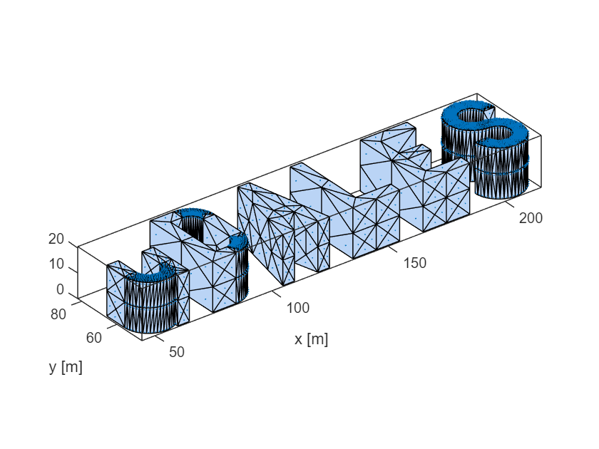
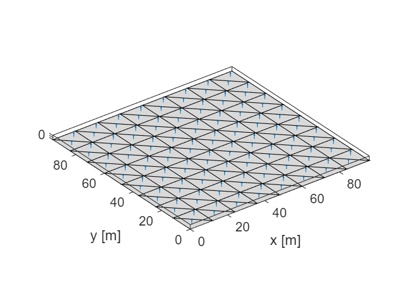
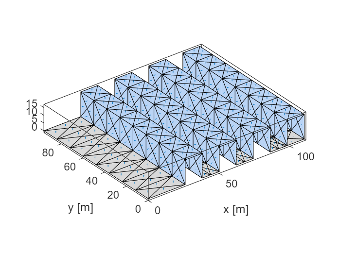
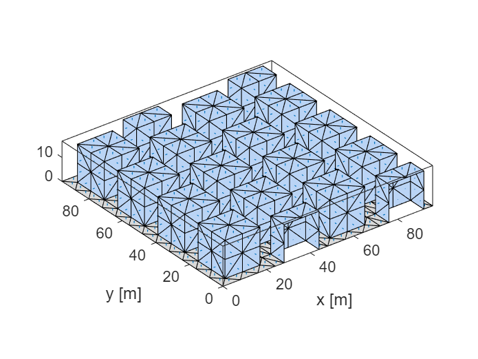
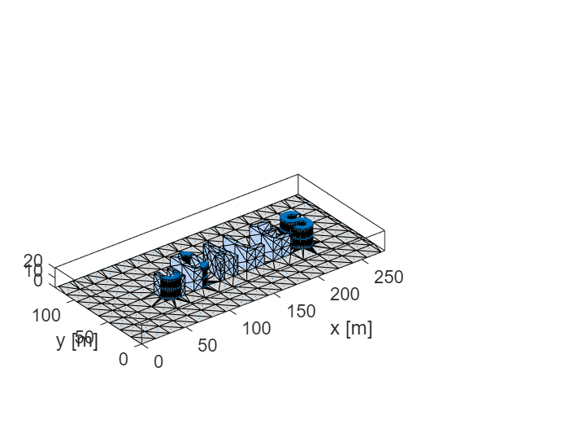

# uDALES urban surface creation


uDALES supports several manners to create urban surfaces. It is possible to run uDALES without specifying an urban surface, in which case a flat terrain is assumed. In most cases however, an urban surface will be specified. uDALES contains a number of functions in the [**udgeom**](#the-udgeom-class) package that aid geometry generation:


   -  [**udgeom.createFlatSurface**](#udgeomcreateflatsurface). This function creates a flat surface. The main reason for using this function is to be able to discretise the surface in as many facets as possible in case heterogeneous boundary conditions are required. 
   -  [**udgeom.createCanyons**](#udgeomcreatecanyons). This function creates one-dimensional street canyons. 
   -  [**udgeom.createCubes**](#udgeomcreatecubes). This function creates cubes, either a single one or an array of cubes. 
   -  [**udgeom.createRealistic**](#udgeomcreaterealistic). This function creates a realistic urban surface based on an stl file that contains the buildings. The function adds the ground surface. 


**Note that the uDALES/tools/matlab path must be added via the Set Path button in order to use the udgeom package. Alternatively, it can be added using the addpath function inside the script (done here).**


```matlab:Code
% preamble
clear variables
close all

% add the uDALES matlab path
addpath('../matlab')
```

## The udgeom class


The udgeom class contains the uDALES urban surface. It is the output of the geomety creation routines mentioned above. The class can load STL files, display the geometry and save to STL files as shown below.


```matlab:Code
help udgeom.udgeom
```


```text:Output
  udgeom Geometry class for uDALES
     The udgeom class contains the triangulated surface.

    Documentation for udgeom.udgeom
```


```matlab:Code
geom = udgeom.udgeom();    % create udgeom instance. 
methods(geom);             % show the methods the class contains
```


```text:Output
Methods for class udgeom.udgeom:

chcpath  gohome   gopath   load     save     show     udgeom   

Methods of udgeom.udgeom inherited from handle.
```


```matlab:Code
geom.load('uDALES.stl')    % load an STL file from the current directory (can be changed in constructor)
geom.show()                % show the geometry
xlabel('x [m]'); 
ylabel('y [m]')
```





```matlab:Code
geom.save('uDALES2.stl')   % saves the object as an STL file
```

## udgeom.createFlatSurface


This function creates flat surfaces


```matlab:Code
help udgeom.createFlatSurface
```


```text:Output
  createFlatSurface    creates flat surface consisting of triangular facets
 
     geom = createFlatSurface(xsize, ysize, edgelength) returns a geom
     instance that can be saved to an stl file.
         xsize:  length of the domain in x-direction
         ysize:  length of the domain in y-direction
         edgelength: the length of individual facets. Best taken as xsize
         (or ysize) divided by an integer number.
```


See below for an example how to use this function.


```matlab:Code
% domain size
xsize = 96;           % [m]
ysize = xsize;        % [m]
edgelength = xsize/8; % [m] 

geom = udgeom.createFlatSurface(xsize, ysize, edgelength);
geom.show; 
xlabel('x [m]'); 
ylabel('y [m]')
```




# udgeom.createCanyons


This function creates one-dimensional street canyons


```matlab:Code
help udgeom.createCanyons
```


```text:Output
  createCanyons    creates one-dimensional street canyons
 
     geom = createCanyons(xsize, ysize, B, W, H, shift, edgelength) returns
     a geom instance that can be saved to an stl file.
         xsize:      length of the domain in x-direction
         ysize:      length of the domain in y-direction
         B:          building width
         W:          street width
         H:          building height
         shift:      shifts the canyons to the right in the x-direction 
         edgelength: the length of individual facets. Best taken as xsize
                     (or ysize) divided by an integer number.
         rotate90:   boolean that allows one to rotate the domain once it
                     has been generated. Set this parameter to false under
                     normal conditions.
```


See below for an example how to use this function.


```matlab:Code
% domain size
xsize = 96;       % domain size in x-direction
ysize = 96;       % domain size in y-direction

% canyon properties
B = 12;           % building width
H = 16;           % building height
W = 12;           % street width
shift = 20;       % make the canyons start a distance from the west-boundary of the domain. 
                  % Note this makes the domain larger in the x-direction.
edgelength = 6;   % facet size
rotate90 = false; % default value

geom = udgeom.createCanyons(xsize, ysize, B, W, H, shift, edgelength, rotate90);
geom.show; 
xlabel('x [m]'); 
ylabel('y [m]')
```




# udgeom.createCubes


This function creates cubes, either a single one or an array of cubes.


```matlab:Code
help udgeom.createCubes
```


```text:Output
  createCubes    creates cubes, either a single one or an array of cubes.
 
     geom = createCubes(xsize, ysize, Hx, Hy, Hz, Cx, Cy, geom_option, edgelength)
     returns a geom instance that can be saved to an stl file.
         xsize:       length of the domain in x-direction
         ysize:       length of the domain in y-direction
         Hx:          cube x-length
         Hy:          cube y-length
         Hz:          cube height
         Cx:          cube spacing in x-direction
         Cy:          cube spacing in y-direction
         geom_option: the type of geometry to create:
                                 'S': single cube
                                'AC': aligned cubes
                                'SC': staggered cubes
         edgelength: the length of individual facets. Best taken as xsize
                     (or ysize) divided by an integer number.
```


See below for an example how to use this function.


```matlab:Code
% domain size
xsize = 96; 
ysize = 96; 

% cube length in each direction
Hx = 16; 
Hy = 16; 
Hz = 16; 

% canyon length in each direction
Cx = 8; 
Cy = 8; 

% geometry type
%     S: single cube
%    AC: aligned cubes
%    SC: staggered cubes

geom_type = 'SC';

edgelength = 8;

geom = udgeom.createCubes(xsize, ysize, Hx, Hy, Hz, Cx, Cy, geom_type, edgelength);
geom.show; 
xlabel('x [m]'); 
ylabel('y [m]')
```




# udgeom.createRealistic


This function creates a realistic urban surface based on an stl file that contains the buildings. The function adds the ground surface.


```matlab:Code
help udgeom.createRealistic
```


```text:Output
  createRealistic    creates a realistic urban surface based on an stl file
                     that contains the buildings. The function adds the
                     ground surface.  
 
     geom = createRealistic(stlfile, xsize_og, ysize_og, shift, edgelength)
     returns a geom instance that can be saved to an stl file. 
         stlfile:    the STL file that contains the buildings (NOT the
                     ground)
         xsize_og:   length of the original domain in x-direction
         ysize_og:   length of the original domain in y-direction
         shift:      array that shifts the geometry. shift[1], shift[2] and
                     shift[3] represent, respectively, the shift in x-, y-
                     and z-direction.
         edgelength: the length of individual facets. Best taken as xsize
                     (or ysize) divided by an integer number.
 
  Note that the output domain size is
      xsize = xsize_og + shift[1]
      ysize = ysize_og + shift[2]
```


See below for an example how to use this function.


```matlab:Code
% stl file containing buildings only
stlfile = 'uDALES.stl';

% original domain size
xsize_og = 256; 
ysize_og = 128; 

% example translation to make domain larger in x direction
shift = [20 0 0];

% ground facet size
edgelength = 16;

geom = udgeom.createRealistic(stlfile, xsize_og, ysize_og, shift, edgelength);
geom.show; 
xlabel('x [m]'); 
ylabel('y [m]')
```




