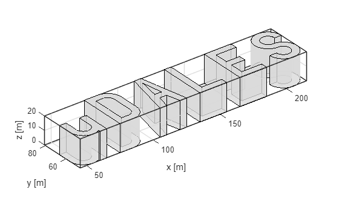
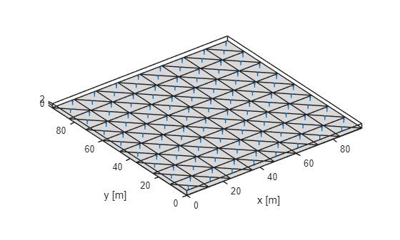

# uDALES urban surface creation

uDALES supports several manners to create urban surfaces. It is possible to run uDALES without specifying an urban surface, in which case a flat terrain is assumed. In most cases however, an urban surface will be specified. uDALES contains a number of functions in the [**udgeom**](#the-udgeom-class) package that aid geometry generation:

- [**udgeom.createFlatSurface**](#udgeomcreateflatsurface). This function creates a flat surface. The main reason for using this function is to be able to discretise the surface in as many facets as possible in case heterogeneous boundary conditions are required.
- [**udgeom.createCanyons**](#udgeomcreatecanyons). This function creates one-dimensional street canyons.
- [**udgeom.createCubes**](#udgeomcreatecubes). This function creates cubes, either a single one or an array of cubes.
- [**udgeom.createRealistic**](#udgeomcreaterealistic). This function creates a realistic urban surface based on an stl file that contains the buildings. The function adds the ground surface.

**The live matlab file of this tutorial can be found in the repository in the folder /docs/tutorial_mlx.**

## Initialising udbase

**Note that the uDALES/tools/matlab path must be added via the Set Path button in order to use the udgeom package. Alternatively, it can be added using the addpath function inside the script (done here).**

```matlab
% preamble
clear variables
close all

% add the uDALES matlab path
addpath('path_to_udales\tools\matlab')
```

## The udgeom class

The udgeom class contains the uDALES urban surface. It is the output of the geomety creation routines mentioned above. The class can load STL files, display the geometry and save to STL files as shown below.

```matlab
help udgeom.udgeom
```

```matlabTextOutput
  udgeom Geometry class for uDALES
     The udgeom class contains the triangulated surface.

    Documentation for udgeom.udgeom
```

```matlab
geom = udgeom.udgeom();    % create udgeom instance.
methods(geom);             % show the methods the class contains
```

```matlabTextOutput
Methods for class udgeom.udgeom:

calculate_outline2d       chcpath                   get_building_outlines     get_buildings             get_face_to_building_map  get_outline               gohome                    gopath                    load                      save                      show                      show_outline              udgeom

Methods of udgeom.udgeom inherited from handle.
```

These methods can be used as follows

```matlab
help geom.load
```

```matlabTextOutput
--- help for udgeom.udgeom/load ---

  load an STL file.

  example:
    obj.load(obj, filename)
```

```matlab
help geom.save
```

```matlabTextOutput
--- help for udgeom.udgeom/save ---

  save an STL file.

  example:
    obj.save(obj, filename)
```

```matlab
help geom.show
```

```matlabTextOutput
--- help for udgeom.udgeom/show ---

  plot the geometry

  show(obj, colorbuildings)
        colorbuildings (optional): boolean parameter on whether
                                   to colour buildings. This
                                   parameter is true by default.
                                   Needs to be set to false for
                                   large geometries.

  examples:
    obj.show();
    obj.show(false);
```

Here is a simple example on how to use this class:

```matlab

geom.load('uDALES.stl')    % load an STL file from the current directory (can be changed in constructor)
geom.show();               % show the geometry
xlabel('x [m]');
ylabel('y [m]')
```


Another way is to show the outline.

```matlab
help geom.show_outline
```

```matlabTextOutput
--- help for udgeom.udgeom/show_outline ---

  Plot the geometry outline edges

  show_outline(obj) plots the precomputed outline edges of the geometry
  show_outline(obj, angle_threshold) recalculates outline with custom threshold

  Parameters:
    angle_threshold (optional): Angle threshold in degrees for edge detection
                               If not provided, uses precomputed outline

  Examples:
    obj.show_outline();     % Use precomputed outline
    obj.show_outline(30);   % Recalculate with 30┬░ threshold
```

Here is a simple example on how to use this method:

```matlab
geom.show_outline();               % show the geometry outline
xlabel('x [m]');
ylabel('y [m]')
```



## udgeom.createFlatSurface

This function creates flat surfaces

```matlab
help udgeom.createFlatSurface
```

```matlabTextOutput
  createFlatSurface    creates flat surface consisting of triangular facets

     geom = createFlatSurface(xsize, ysize, edgelength) returns a geom
     instance that can be saved to an stl file.
         xsize:  length of the domain in x-direction
         ysize:  length of the domain in y-direction
         edgelength: the length of individual facets. Best taken as xsize
         (or ysize) divided by an integer number.
```

See below for an example how to use this function.

```matlab
% domain size
xsize = 96;           % [m]
ysize = xsize;        % [m]
edgelength = xsize/8; % [m]

geom = udgeom.createFlatSurface(xsize, ysize, edgelength);
geom.show;
xlabel('x [m]');
ylabel('y [m]')
```



## udgeom.createCanyons

This function creates one-dimensional street canyons

```matlab
help udgeom.createCanyons
```

```matlabTextOutput
  createCanyons    creates one-dimensional street canyons

     geom = createCanyons(xsize, ysize, B, W, H, shift, edgelength) returns
     a geom instance that can be saved to an stl file.
         xsize:      length of the domain in x-direction
         ysize:      length of the domain in y-direction
         B:          building width
         W:          street width
         H:          building height
         shift:      shifts the canyons to the right in the x-direction
         edgelength: the length of individual facets. Best taken as xsize
                     (or ysize) divided by an integer number.
         rotate90:   boolean that allows one to rotate the domain once it
                     has been generated. Set this parameter to false under
                     normal conditions.
```

See below for an example how to use this function.

```matlab
% domain size
xsize = 96;       % domain size in x-direction
ysize = 96;       % domain size in y-direction

% canyon properties
B = 12;           % building width
H = 16;           % building height
W = 12;           % street width
shift = 20;       % make the canyons start a distance from the west-boundary of the domain.
                  % Note this makes the domain larger in the x-direction.
edgelength = 6;   % facet size
rotate90 = false; % default value

geom = udgeom.createCanyons(xsize, ysize, B, W, H, shift, edgelength, rotate90);
geom.show;
xlabel('x [m]');
ylabel('y [m]')
```


## udgeom.createCubes

This function creates cubes, either a single one or an array of cubes.

```matlab
help udgeom.createCubes
```

```matlabTextOutput
  createCubes    creates cubes, either a single one or an array of cubes.

     geom = createCubes(xsize, ysize, Hx, Hy, Hz, Cx, Cy, geom_option, edgelength)
     returns a geom instance that can be saved to an stl file.
         xsize:       length of the domain in x-direction
         ysize:       length of the domain in y-direction
         Hx:          cube x-length
         Hy:          cube y-length
         Hz:          cube height
         Cx:          cube spacing in x-direction
         Cy:          cube spacing in y-direction
         geom_option: the type of geometry to create:
                                 'S': single cube
                                'AC': aligned cubes
                                'SC': staggered cubes
         edgelength: the length of individual facets. Best taken as xsize
                     (or ysize) divided by an integer number.
```

See below for an example how to use this function.

```matlab
% domain size
xsize = 96;
ysize = 96;

% cube length in each direction
Hx = 16;
Hy = 16;
Hz = 16;

% canyon length in each direction
Cx = 8;
Cy = 8;

% geometry type
%     S: single cube
%    AC: aligned cubes
%    SC: staggered cubes

geom_type = 'SC';

edgelength = 8;

geom = udgeom.createCubes(xsize, ysize, Hx, Hy, Hz, Cx, Cy, geom_type, edgelength);
geom.show;
xlabel('x [m]');
ylabel('y [m]')
```

## udgeom.createRealistic

This function creates a realistic urban surface based on an stl file that contains the buildings. The function adds the ground surface.

```matlab
help udgeom.createRealistic
```

```matlabTextOutput
  createRealistic    creates a realistic urban surface based on an stl file
                     that contains the buildings. The function adds the
                     ground surface.  

     geom = createRealistic(stlfile, xsize, ysize, shift, edgelength)
     returns a geom instance that can be saved to an stl file.
         stlfile:    the STL file that contains the buildings (NOT the
                     ground)
         xsize:      length of the new domain in x-direction
         ysize:      length of the new domain in y-direction
         shift:      array that shifts the geometry. shift[1], shift[2] and
                     shift[3] represent, respectively, the shift in x-, y-
                     and z-direction.
         edgelength: the length of individual facets. Best taken as xsize
                     (or ysize) divided by an integer number.
```

See below for an example how to use this function.

```matlab
% stl file containing buildings only
stlfile = 'uDALES.stl';

% original domain size
xsize_og = 256;
ysize_og = 128;

% example translation to make domain larger in x direction
shift = [20 0 0];

% ground facet size
edgelength = 16;

geom = udgeom.createRealistic(stlfile, xsize_og, ysize_og, shift, edgelength);
geom.show;
xlabel('x [m]');
ylabel('y [m]')
```
