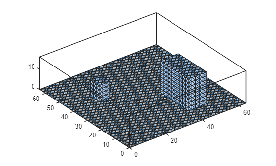
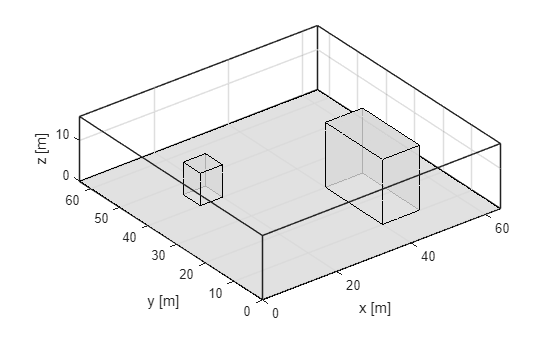

# Introduction to uDALES post-processing with MATLAB

This tutorial describes how to read and process facet data of the LES code uDALES using MATLAB. This tutorial introduces the `udbase` post-processing class. There are separate tutorials for processing field files and facet files.
The **`udbase`** post-processing class reads in most important input parameters, and contains a number of methods to load field and facet data.
**Field data:**

- **load_stat_xyt**. This method load the 1D slab- and time-averaged statistics from the file `xytdump.expnr.nc`. Several time-intervals may be present in the data.
- **load_stat_t**. This method loads the 3D time-averaged statistics from the file `tdump.expnr.nc`. Several time-intervals may be present in the data.
- **load_stat_tree**. This method loads the 3D time-averaged statistics of the tree source terms from the file `treedump.expnr.nc`. This method works exactly the same way as `load\\_stat\\_t`.
- **load_field**. This method loads instantaneous 3D data from the file `fielddump.expnr.nc`. Several output times may be present in the data.
- **load_slice**. This method loads instantaneous 2D slices of instantaneous 3D data from the file `Xslicedump.expnr.nc`. Several output times may be present in the data.
- **coarse_graining**. This method applies spatial filtering to 3D field data using FFT-based convolution. Multiple filter sizes are applied simultaneously using physical length scales (meters) as input parameters.
- **merge_stat_cov**. This method merges short-time covariance statistics into longer-time averages by grouping time series data into non-overlapping windows. It computes windowed means and total covariance for two variables.
- **merge_stat_var**. This method merges short-time variance statistics into longer-time averages for a single variable. It is a specialized wrapper around `merge_stat_cov` for computing windowed means and variance.

**Facet data:**

- **calculate_frontal_properties**. This method calculates the skylines, frontal areas and blockage ratios in the x- and y-direction.
- **plot_fac_type**. This method displays the type of surface for each facet.
- **assign_prop_to_fac**. This method assigns a property of the facet type to each of the facets, so it can be used for calculation and visualisation
- **plot_fac**. This method displays a surface variable on the mesh.
- **load_fac_momentum**. This method loads instantaneous momentum surface data from `fac.expnr.nc`. The first index is the facet id and second index is time.
- **load_fac_eb**. This method loads instantaneous surface energy balance data from `facEB.expnr.nc`. The first index is the facet id and second index is time.
- **load_seb**. This method loads all instantaneous surface energy balance terms. The first index is the facet id and second index is time.
- **load_fac_temperature**. This method loads instantaneous facet temperature data `facT.expnr.nc`. The first index is the facet id, the second is the layer index and the third index is time.
- **area_average_seb.** This method calculates the area-averaged surface energy balance from the facet surface energy balances obtained using `load_seb`.
- **area_average_fac.** This method performs area-averaging over (a selection of) the facets. The facet index is assumed to be the first index of the array.
- **plot_trees.** This method volumetric tree blocks along with the STL geometry.
- **convert_fac_to_field**. This method converts a facet variable to a density in a 3D field, so it can be used for post-processing (e.g. calculating distributed drag).

**The live matlab file of this tutorial can be found in the repository in the folder /docs/tutorial_mlx.**

## Initialising udbase

The starting point of this tutorial is that you have run a simulation and have merged the output files. If the simulations were performed on a HPC system, **we assume that you have copied the output directory to your own workstation**. Some of the netCDF (*.nc) files may be very large and you may only want to copy these if you plan to analyse the data.
The uDALES postprocessing class is called `udbase`. Typically, you will create a post-processing script in the output directory on your workstation, but it is also possible to have the output directory located in another directory. This is particularly useful if you are comparing several different simulations at the same time. Here, we will show how to use data from simulation 065 (`expnr=065)` that is located in a different directory from the one you are working in.
**Note that the uDALES/tools/matlab path must be added via the Set Path button in order to use the udbase class. Alternatively, it can be added using the addpath function inside the script (done here).**

```matlab
% preamble
clear variables
close all
% add the uDALES matlab path
addpath('path_to_udales\tools\matlab')
% create an instance of the udbase class
expnr = 065;
expdir = 'path_to_experiments\065';
sim = udbase(expnr, expdir);
```

The constructor can have a number of input parameters:

```matlab
help udbase.udbase
```

```text
  Class constructor.


  udbase(expnr, dapath, load_preprocdata)
     expnr:                       experiment number
     dapath (optional):           path to the experiment

  Example:
    obj = udbase(expnr, '/path/experiments/../100');
    Documentation for udbase/udbase
```

The constructor of the `udbase` class reads in the following files:

- `namoptions.expnr. C`ontains the simulation input parameters.
- `xxx.stl.` Contains the urban geometry used for the simulation \[optional\].

Provided that `load_preprocdata` is not set to false, the constructor of the `udbase` class additionally reads the following files:

- `solid_(u,v,w,c).txt.` Contains the indices of the (u,v,w,c)\-volumes occupied by buildings.
- `facets.inp`. Contains information about the facet wall type and surface normal.
- `factypes.inp`. Contains information about the properties of the wall types.
- `facetarea.inp`. Contains information about the facet areas.
- `fluid_boundary_(u,v,w,c).txt`. Contains information about the fluid cells associated with facet sections.
- `facet_sections_(u,v,w,c).txt`. Information about facet section area, distance and flux point.

## Accessing simulation properties

To view all simulation input parameters, simply type

```matlab
sim
```

```text
sim =
  udbase with properties:
              expnr: '065'
               geom: [1x1 udgeom.udgeom]
                 xm: [64x1 double]
                 ym: [64x1 double]
                 zm: [64x1 double]
                 xt: [64x1 double]
                 yt: [64x1 double]
                 zt: [64x1 double]
                 dx: 1
                 dy: 1
                dzm: [64x1 double]
                dzt: [64x1 double]
                 Su: [64x64x64 logical]
                 Sv: [64x64x64 logical]
                 Sw: [64x64x64 logical]
                 Sc: [64x64x64 logical]
               facs: [1x1 struct]
           factypes: [1x1 struct]
             facsec: [1x1 struct]
              trees: []
             ltdump: 0
                nnz: 909975
             iexpnr: 65
          nbndpts_u: 5208
         tstatsdump: 5
               thl0: 301
               dtEB: 1
       solarazimuth: 135
                qt0: 0.0100
           sinkbase: 32
          igrw_damp: 0
               jtot: 64
          nsolpts_v: 3696
           lBImin_c: 0
         stl_ground: 1
           iadv_thl: 2
            ltempeq: 1
          vflowrate: 0
         nfctsecs_u: 11214
          nbndpts_w: 5164
             ipoiss: 0
          nbndpts_v: 5208
           fraction: 0.5000
             lmoist: 1
             nprocy: 4
               maxD: 64
          nsolpts_c: 3488
                 z0: 0.0100
          uflowrate: 5
              dtmax: 5
               flrT: 298
    lperiodicEBcorr: 1
          nsolpts_u: 3856
         luvolflowr: 1
            tsample: 1
              zsize: 64
              skyLW: 395
            lconstW: 1
          lvfsparse: 1
         nfctsecs_v: 12010
               libm: 1
          lbuoyancy: 1
          nbndpts_c: 5164
           trestart: 51000
      lwriteEBfiles: 1
              nfcts: 2658
           lxytdump: 1
           lBImin_u: 0
       diag_neighbs: 0
              rsmin: 200
                wfc: 314
               xlen: 64
              wwilt: 172
         lfielddump: 0
               ktot: 64
               itot: 64
            irandom: 43
           stl_file: 'geom.065.stl'
           lBImin_w: 0
           lBImin_v: 0
               ylen: 64
         tfielddump: 11
           nfaclyrs: 5
                 u0: 2
               facT: 301
              GRLAI: 2.1000
             wtsurf: 0
            iadv_qt: 2
                z0h: 6.7000e-05
            runtime: 10000
             min_vf: 0.0100
                lEB: 1
         nfctsecs_w: 2817
              randu: 0.0100
             wgrmax: 451
          lwritefac: 1
         iwallmoist: 2
         lvoutflowr: 0
        solarzenith: 45
          fieldvars: ''v0,th,qt,u0,w0''
              wsoil: 250
          nsolpts_w: 7584
               Dsky: 107.2000
               bldT: 298
                 ps: 101300
            lvreman: 1
             nprocx: 8
         nfctsecs_c: 7940
         lrandomize: 1
          ladaptive: 1
                  I: 814
              lflat: 1
              dtfac: 10
          iwalltemp: 2
             wqsurf: 0
```

For a complete list of parameters and their meaning, please consult the pre-processing documentation. Some commonly used parameters are

- `xlen`, `ylen` and `zsize` that represent the domain size
- `itot`, `jtot` and `ktot` that represent the total number of grid cells

To access a parameter directly, use the syntax `object.prop`. To access the domain length in x-direction, use

```matlab
sim.xlen
```

```text
ans = 64
```

The geometry stored in the STL file, if present, has been also loaded, which can be visualised using the method below. This method will produce an error if STL file does not exist or been loaded.

```matlab
sim.geom.show();
```


This shows all individual faces. Use `show_outline` to see the building outlines.

```matlab
sim.geom.show_outline();
```


