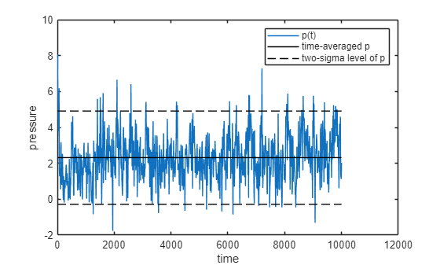
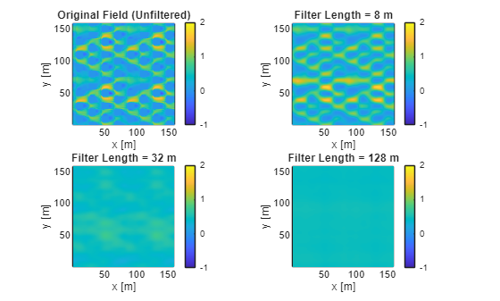

# Using uDALES utilities in MATLAB

This tutorial demonstrates how to use the uDALES MATLAB utilities for post-processing simulation data. It covers 1) time-averaging; 2) merging short-term time-averaged data to long-term averages, and 3) coarse-graining fields for Spatial filtering (coarse-graining method). The utility functions include:

- [**time_average**](#time_average-time-averaged-mean-and-variance-of-instantaneous-data). This routine calculates the time-average of a quantity (assumes time is in the last index of the variable).
- [**merge_stat**](#merge_stat-combine-short-term-time-average-into-a-long-term-time-average)**.** This routine merges the short-term time average and (co)variance into long-term averages and associated (co)variance.
- [**coarsegrain_field**](#coarsegrain_field-coarse-graining-3d-fields)**.** This routine allows you to coarse-grain a field using a planar filter in the x-y plane using a fixed lengthscale [1].

## time_average: time-averaged mean and variance of instantaneous data

`time_average` function returns the mean and variance of time-series data (fields, facets, timeseries, ...). The method assumes that time is the last array index.

```matlab
help time_average
```

```matlabTextOutput
  time_average  Time-average variables over all available time intervals

    [Xmean, var] = time_average(X)
        Compute the time-averaged mean and variance of X over the full
        time record (time is assumed to be the last dimension).

    [Xmean, Ymean, cov] = time_average(X, Y)
        Compute the time-averaged means of X and Y and their covariance
        over the full time record.

  Inputs:
    X   - First variable time series. The final array dimension is assumed
          to be time (e.g. size(X) = [..., Nt]).
    Y   - Second variable time series (same shape as X) [optional]

  Outputs:
    For single variable (1 input):
      Xmean - Time-averaged X over the full record
      var   - Time-averaged variance over the full record

    For two variables (2 inputs):
      Xmean - Time-averaged X over the full record
      Ymean - Time-averaged Y over the full record
      cov   - Time-averaged covariance over the full record

  Examples:
    [X_avg, X_var] = time_average(X);
    [X_avg, Y_avg, XY_cov] = time_average(X, Y);
```

For example, let's load instantaneous pressure data for facets:

```matlab
% preamble
clear variables
close all

% add the uDALES matlab path
addpath('path_to_udales\tools\matlab')

% create an instance of the udbase class
expnr = 065;  % Experiment number
expdir = 'path_to_experiments\065';
sim = udbase(expnr, expdir);

p = sim.load_fac_momentum('pres');
t = sim.load_fac_momentum('t');
```

Now, let's calculate pressure mean and variance

```matlab
[pav, pvar] = time_average(p);
```

Plot the time-series of $p$ together with the mean and the 95% confidence interval

```matlab
figure
plot(t, p(1,:), t, ones(size(t)) *pav(1),'k-'); hold on
plot(t, ones(size(t)) *(pav(1)+ 2* sqrt(pvar(1))), 'k--', t, ones(size(t)) *(pav(1)- 2* sqrt(pvar(1))), 'k--')
legend('p(t)', 'time-averaged p','two-sigma level of p')
xlabel 'time'; ylabel 'pressure';
```



The function can also be used to calculated the time average and covariance of **two variables.** For example, let's calculate the covariance of the facet pressure and x-component shear stress $\overline{p^{\prime } \tau_x^{\prime } }$:

```matlab
taux = sim.load_fac_momentum('tau_x');
[pbar, tauxbar, ptauxbar] = time_average(p, taux);

% check output for the first facet
fprintf('The time-averaged pressure pbar=%.3f m2/s2, tauxbar=%.3f m2/s2 and their covariance p''taux''bar=%.3f m4/s4.\n', ...
    pbar(1), tauxbar(1), ptauxbar(1));
```

```matlabTextOutput
The time-averaged pressure pbar=2.314 m2/s2, tauxbar=-0.032 m2/s2 and their covariance p'taux'bar=0.049 m4/s4.
```

The value of `pbar` returned by both methods is identical. Note that this example is quite exotic as we only had loaded facet data; more conventional covariances are $\overline{w^{\prime } u^{\prime } }$, $\overline{w^{\prime } p^{\prime } }$ etc.

## merge_stat: combine short-term time average into a long-term time average

uDALES statistics are collected over fixed time-windows. Sometimes these time windows may be a bit too short. The function `merge_stat` is able to combine several of time-windows into larger ones.

Let's start with loading short-term time-averaged data, for example the 1-D plane average

```matlab
% Use a different simulation
expnr = 110;  % Experiment number
expdir = 'path_to_experiments\110';
sim = udbase(expnr, expdir);
```

```matlabTextOutput
Warning: prof.inp.110 not found. Assuming equidistant grid.
```

```matlab

% load xy- and time-averaged data
uxyt = sim.load_stat_xyt('uxyt');        % u-velocity profile (z) [m/s]
wxyt = sim.load_stat_xyt('wxyt');        % w-velocity profile [m/s]
upupxyt = sim.load_stat_xyt('upuptxyc'); % u-velocity variance [m²/s²]
upwpxyt = sim.load_stat_xyt('upwpxyt');  % u-w velocity covariance [m²/s²]
time = sim.load_stat_xyt('time');        % Time coordinate for xyt data [s]
```

Check the averaging time interval

```matlab
time
```

```matlabTextOutput
time = 3x1 single column vector
1.0e+03
2.0001
4.0001
6.0001

```

```matlab
length(time)
```

```matlabTextOutput
ans = 3
```

So there are three time-averaging intervals. Long-term time averaging can be used by using

```matlab
help merge_stat
```

```matlabTextOutput
  merge_stat  Merge short-time statistics into longer-time averages

    Xmean = merge_stat(X, n)
        Computes time-averaged mean for a single variable X.
        Groups the time series into non-overlapping windows of length n
        and computes statistics inside each window.

    [Xmean, var] = merge_stat(X, XpXp, n)
        Computes time-averaged mean and variance for a single variable X.
        Groups the time series into non-overlapping windows of length n
        and computes statistics inside each window.

    [Xmean, Ymean, cov] = merge_stat(X, Y, XpYp, n)  
        Computes time-averaged means and covariance for two variables X and Y.
        Groups the time series into non-overlapping windows and computes
        statistics inside each window.

  Inputs:
    X    - First variable time series (time in final dimension)
    Y    - Second variable time series (same shape as X) [two-variable case only]
    XpXp - Instantaneous variance contribution (same shape as X) [single-variable]
    XpYp - Instantaneous covariance contribution (same shape as X and Y) [two-variable]  
    n    - Window length (number of time samples per averaged window)

  Outputs:
    Xmean - Time-averaged X in each window
    Ymean - Time-averaged Y in each window [two-variable case only]
    var   - Time-averaged variance in each window [single-variable case]
    cov   - Time-averaged covariance in each window [two-variable case]

  Examples:
     X_avg = merge_stat(X, 20);
    [X_avg, X_var] = merge_stat(X, XpXp, 20);
    [X_avg, Y_avg, XY_cov] = merge_stat(X, Y, XpYp, 50);
```

This function needs all the short-term variables related as the input, plus an average time window. The long-term average is simply the average of the short-term averages, but the long-terms variance contains both contribution from variance in the short-term mean and the short term variance. Please ensure that the last dimension of the input must be the time, as the function merges on that dimension.

Let's start with **two variables and their covariance**, obtaining long-term quantities for $\overline{u}$, $\bar{w}$ and their covariance $\overline{u^{\prime } w^{\prime } }$ over all three time segments:

```matlab
Nwindow = length(time);

% input all the short-term variables related
[uxyt_longterm, wxyt_longterm, upwpxyt_longterm] = merge_stat(uxyt, wxyt, upwpxyt, Nwindow);
```

if you only need **one variable**, e.g., the long-term quantities for $\overline{u}$ and $\overline{u^{\prime } u^{\prime } }$ over all time, you can reduce it to:

```matlab
[uxyt_longterm, upupxyt_longterm] = merge_stat(uxyt, upupxyt, Nwindow);
```

Naturally both versions return the same value for `uxyt_longterm.` Let's check the dimension of the short-term and long-term statistics

```matlab
size(uxyt)
```

```matlabTextOutput
ans = 1x2

256    3

```

```matlab
size(uxyt_longterm)
```

```matlabTextOutput
ans = 1x2

256    1

```

If you want an average over shorter window, you can an optional parameter to `merge_stat`::

```matlab
Nwindow = 2;
[uxyt_longterm, upupxyt_longterm] = merge_stat(uxyt, upupxyt, Nwindow);

size(uxyt_longterm)
```

```matlabTextOutput
ans = 1x2

256    1

```

There were three intervals in uxut, and the last two were used to average over. The first time-interval has been discarded.

## coarsegrain_field: coarse-graining 3D fields

We recently developed a coarse-graining method that is computationally efficient and can be used to coarse-grain data [1]. In order to demonstrate its use, let's load the mean horizontal velocity $\overline{u}$ from the uDALES data.

```matlab
ut = sim.load_stat_t('ut');
```

The coarse-graining routine has the following syntax:

```matlab
help coarsegrain_field
```

```matlabTextOutput
  coarsegrain_field  Apply 2D spatial filter to 3D field data.

    var_filtered = coarsegrain_field(var, Lflt, xm, ym)

  This function applies 2D spatial (x-y) coarse-graining filters to 3D field data.
  Multiple filter sizes are applied simultaneously, creating a 4D output
  where the 4th dimension corresponds to different filter sizes.

  Inputs
    var     - 3D field data with dimensions [itot, jtot, ktot] where
              the first two dimensions are horizontal (x, y) and the
              third is vertical (z) or time. Field is assumed periodic.
    Lflt    - Array of filter lengths in physical units (meters)
    xm      - x-coordinates of grid points (meters)
    ym      - y-coordinates of grid points (meters)

  Outputs
    var_filtered - 4D filtered data with dimensions [itot, jtot, ktot, length(Lflt)]
                   where the 4th dimension corresponds to different filter sizes

  Algorithm
    - Converts physical filter lengths to grid cell numbers (Ng = round(Lflt/dx))
    - Works at discrete level with normalized periodic filters  
    - Uses FFT-based convolution for computational efficiency

  Example:
    % Apply multiple filter sizes to velocity field
    filter_lengths = [10, 20, 40, 80, 160]; % Physical lengths in meters
    u_filtered = coarsegrain_field(u_data, filter_lengths, xm, ym);
```

The routine takes in multiple filter lengths simultaneously.

```matlab
filter_lengths = [8 32 128];  % Filter widths in meters

% filter the last field
u_filtered = coarsegrain_field(ut(:,:,:,end), filter_lengths, sim.xm, sim.ym);
```

```matlabTextOutput
 Filter 1/1 (Lflt_x=7.5m, Lflt_y=7.5m) completed
 Filter 2/1 (Lflt_x=32.5m, Lflt_y=32.5m) completed
 Filter 3/1 (Lflt_x=127.5m, Lflt_y=127.5m) completed
Coarse-graining completed in 0.25 seconds
```

```matlab
% Create figure with subplots comparing original and filtered fields

figure
k_level = 10;
% Original field (unfiltered)
subplot(2,2,1)
pcolor(sim.xt, sim.yt, ut(:,:,k_level)');
shading flat; axis equal tight; colorbar;
clim([-1 2])
title('Original Field (Unfiltered)')
xlabel('x [m]'); ylabel('y [m]');

% Filtered fields with increasing filter lengths
filter_titles = {
    sprintf('Filter Length = %.0f m', filter_lengths(1)),
    sprintf('Filter Length = %.0f m', filter_lengths(2)),
    sprintf('Filter Length = %.0f m', filter_lengths(3))
};

for i = 1:3
    subplot(2,2,i+1)
    pcolor(sim.xt, sim.yt, u_filtered(:,:,k_level,i)');
    shading flat; axis equal tight; colorbar;
    clim([-1 2])
    title(filter_titles{i})
    xlabel('x [m]'); ylabel('y [m]');
end
```



## References

[1] Maarten van Reeuwijk, Jingzi Huang (2025) Multi-scale Analysis of Flow over Heterogeneous Urban Environments, *Bound-Lay. Met.* **191**, 47.
