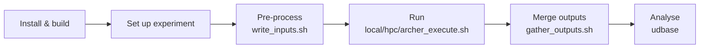

# Workflow overview

A uDALES study follows the same sequence of steps regardless of whether you run on a laptop or an HPC cluster. This page gives the end-to-end picture; each step links to the detailed guide.



## 1. Install and build

Install the prerequisites and build the uDALES executable, either manually with CMake or with the helper script `tools/build_executable.sh`. See [Installation](udales-installation.md).

## 2. Set up an experiment

Each simulation lives in its own experiment directory (e.g. `experiments/001`), identified by a three-digit experiment number. It contains:

- `namoptions.001` — the simulation configuration; see the [input parameters overview](udales-namoptions-overview.md) and [boundary conditions](udales-boundary-conditions.md),
- an STL file describing the building geometry (except for special cases); see [geometry generation](udales-geometry-tutorial.md),
- `config.sh` — paths and settings used by the helper scripts.

The quickest way to start is to adapt one of the [example simulations](udales-example-simulations.md) or [copy an existing setup](udales-copy-inputs.md). Simulations with inflow-outflow boundary conditions may need a [precursor (driver) simulation](udales-driver-simulations.md) to generate inflow data.

## 3. Pre-process

The pre-processing step turns the namoptions file and geometry into the input files the model reads at startup (facets, grids, initial profiles, etc.):

```sh
./u-dales/tools/write_inputs.sh -m experiments/001
```

See [Pre-processing](udales-pre-processing.md) for setup and options, including the Python route (`-p`) and running on clusters.

## 4. Run the simulation

Launch the solver through the wrapper script for your platform — `local_execute.sh` (desktop), `hpc_execute.sh` (ICL cluster), or `archer_execute.sh` (ARCHER2):

```sh
./u-dales/tools/local_execute.sh experiments/001
```

See [Running uDALES](udales-simulation-setup.md), and [cluster workflows](cluster_workflows.md) for cluster-specific notes.

## 5. Merge outputs

uDALES writes one NetCDF file per CPU. After the run, merge them into single output files with `gather_outputs.sh` (done automatically by `local_execute.sh`). See [Post-processing](udales-post-processing.md).

## 6. Analyse

Load and analyse the merged NetCDF output with the `udbase` MATLAB class — see the [udbase](udales-udbase-tutorial.md), [fields](udales-fields-tutorial.md), and [facets](udales-facets-tutorial.md) tutorials. A [Python package](udales-python-package.md) providing the same functionality is under active testing and will replace the MATLAB toolchain from uDALES v3.0 onwards.
