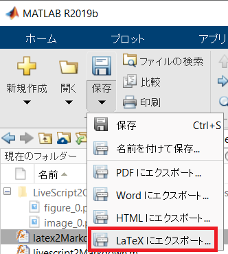
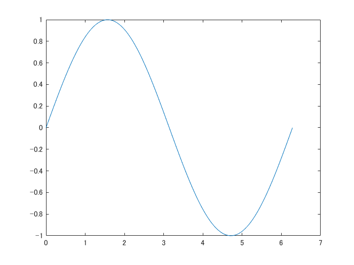
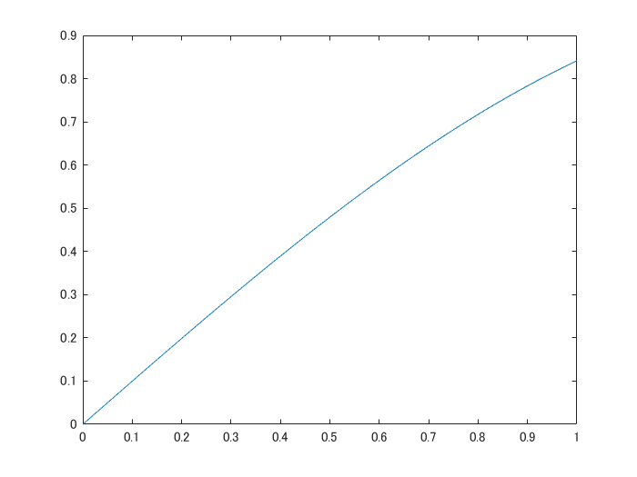

# Converting MATLAB Live Script to Markdown

Copyright 2020-2022 The MathWorks, Inc.

# Introduction

This repository provides a function `latex2markdown.m` that supports you to convert your live scripts to markdown file. I hope this function makes your life easy to document your repository.

Note: This README is also auto generated from a live script `README.mlx.`

## Instruction: Case of converting README.mlx
### Step 1: Convert your live script to Latex.



When README.tex generated by clicking the bottom (indicated by a red square), all the related images, such as inserted images and generated figures, are saved under the folder `README_images.`

**WARNING**: When exporting to LaTeX right after running the livescript, it's observed that the figures will be exported as eps files or not at all if the livescript contains more than 20 figures.I suggest that **you close the script and reopen and then export to latex.**

This part also can be done by a command (see this [MATLAB Answer](https://jp.mathworks.com/matlabcentral/answers/396348-how-to-find-and-replace-within-mlx-live-scripts-across-multiple-files)) but it's a undocumented function. 

### Step 2: Converting to markdown.

```matlab:Code(Display)
latex2markdown('README');
```

will generate README.md; a markdown file suitable for GitHub. You have two options:

   -  `'format'`: It can be `'github'` (default) or `'qiita'`  
   -  `'outputfilename'`: The name of the markdown file to be generated. If unspecified, the output file is going to be the same name as your live script. 
   -  `'png2jpeg'`: It can be `'false'` (default) or `'true'`. Enable to convert PNG images to JPEG images to compress. 
   -  `'ToC'`: It can be `'false'` (default) or `'true'`. Enable to add table of contents. 

Example: A markdown file for Qiita, named QiitaDraft.md will be generated by the following command.

```matlab:Code(Display)
latex2markdown('README','format','qiita','outputfilename','QiitaDraft');
```

Note: Qiita is a tech blog platform in Japanese. Qiita requires markdown to post your articles.

## What are the differences between Qiita and GitHub?

One is the equations and the other is how to insert the image files. 

Qiita allows you to use latex to represent equations (like Gitlab?) whereas GitHub does not. For GitHub the function uses CODECOGS ([https://latex.codecogs.com](https://latex.codecogs.com)) to generate images to show the equations. 

For images, you can just push the image folders and then the README reads them, but you need to drag \& drop your images inside the Qiita Editor.

  
# Syntax that you can use.
# MATLAB Code

MATLAB code and its output and figures will be shown as follows.

```matlab:Code
% matlab code 
x = linspace(0,2*pi,100);
y = sin(x)
```

```text:Output
y = 1x100    
         0    0.0634    0.1266    0.1893    0.2511    0.3120    0.3717    0.4298    0.4862    0.5406    0.5929    0.6428    0.6901    0.7346    0.7761    0.8146    0.8497    0.8815    0.9096    0.9341    0.9549    0.9718    0.9848    0.9938    0.9989    0.9999    0.9969    0.9898    0.9788    0.9638    0.9450    0.9224    0.8960    0.8660    0.8326    0.7958    0.7557    0.7127    0.6668    0.6182    0.5671    0.5137    0.4582    0.4009    0.3420    0.2817    0.2203    0.1580    0.0951    0.0317

```

```matlab:Code
plot(x,y);
```



## Table output

The output of the MATLAB's table variables will be formated as follows:

```matlab:Code
array2table(rand(3,4))
```

| |Var1|Var2|Var3|Var4|
|:--:|:--:|:--:|:--:|:--:|
|1|0.6991|0.5472|0.2575|0.8143|
|2|0.8909|0.1386|0.8407|0.2435|
|3|0.9593|0.1493|0.2543|0.9293|

Note: If the number of variables are smaller than the number of columns, the format is not perfect.

```matlab:Code
table(rand(3,4))
```

| |Var1}| | | |
|:--:|:--:|:--:|:--:|:--:|
|1|0.3500|0.6160|0.8308|0.9172|
|2|0.1966|0.4733|0.5853|0.2858|
|3|0.2511|0.3517|0.5497|0.7572|

Any suggestions to handle merged cells in GitHub markdown are appreciated.

  
## Other outputs.

It's not perfect and I think I haven't throughly checked every possible senarios. Please create issues with the reproduction steps if you find any data types that the function fails to convert.

  
## MATLAB Code Example

For the MATLAB Code example (code snippet) on live editor will be treated as the above. 

```matlab:Code(Display)
% matlab code sample view (実行されないよ）
x = linspace(0,1,100);
y = sin(x);
plot(x,y);
```

# Inserted Images

Here's a display of the inserted image on live scripts.



# Equations

Any equations on live scripts will be exported as latex. For GitHub, CODECOGS helps displaying them. Here's a inline equation. . If you have multiple lines of equations:


And single line of equation is here.


  
# Lists

Here's a unordered list:

   -  Item 1 
   -  Item 2 
   -  Item 3 

Ordered list is here:

   1.  Item A 
   1.  Item B 
   1.  Item C 

# Font Styles

Here are the complete list of font styles available in Live Editor: **Bold**, *Italic*, Underline, `Equispace`. And its conbinations:

***BoldItalic***, **BoldUnderline**, **`BoldEquispace`**, *ItalicUnderline*, *`ItalicEquispace`*, `UnderlineEquispace`, ***BoldItalicUnderline***, ***`BoldItalicEquispace`***, **`BoldUnderlineEquispace`**, *`ItalicUnderlineEquispace`*

Here we neglect the underline.

# Quotation

There's not corresponding function, but here centered paragraph is treated as quotation.

> There's not corresponding function, but here centered paragraph is treated as quotation.

  
# Feedback

Hope it accelerates your MATLAB life. Any comment and suggestions are always appreciated.
