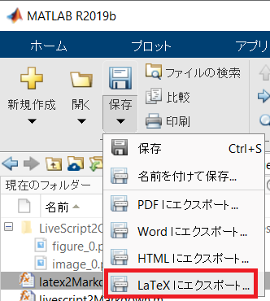
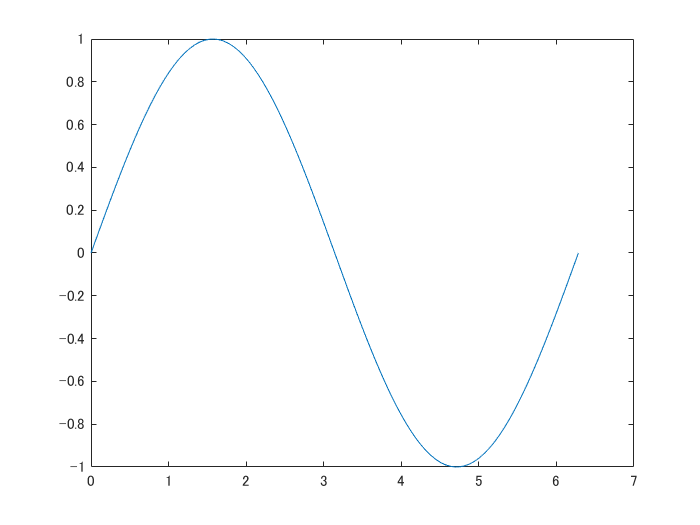
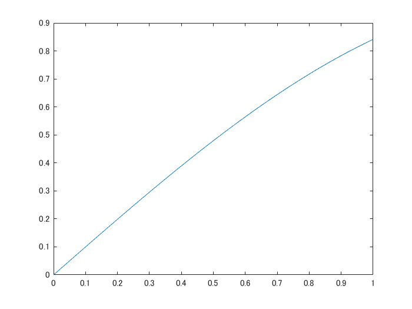

# MATLAB の Live Script から Markdown への自動変換

Copyright 2020-2022 The MathWorks, Inc.

# はじめに

この README は [ライブスクリプト](https://jp.mathworks.com/help/matlab/matlab_prog/what-is-a-live-script-or-function.html) を Qiita/Github の Markdown に自動変換する関数 `latex2markdown.m` を使って出力されたものです。Live Editor 上で使える機能と GitHub での表示を確認してみてください。

  
## 使い方: README.mlx を変換する場合
### Step 1: Latex に変換



LateX に出力した時点で関連画像（live script 内で使用した画像や Figure) は `README_images` というフォルダが作られ、そちらに保存されます。

**WARNING**: Live script を実行した直後にそのままエクスポートすると、画像が eps として出力され、また Figure が多い場合（20個以上）ある場合にはエラーが発生するケースが確認されています。**実行した直後の livescript はいったん閉じ、再度開いたうえで LaTeX に出力するとエラーは回避できます。**

（ここもコマンドで実行する方法はあります（[参考](https://jp.mathworks.com/matlabcentral/answers/396348-how-to-find-and-replace-within-mlx-live-scripts-across-multiple-files)）が非公式である点ご理解ください）

### Step 2: markdown に変換

```matlab:Code(Display)
latex2markdown('README');
```

で GitHub 向けの markdown で README.md が生成されます。オプションは以下の２つ。

   -  `'format'`: 用途に合わせて `'github'` (既定) もしくは `'qiita'` を指定してください。 
   -  `'outputfilename'`: 指定しない場合は、live script と同じ名前`.md` のファイルが生成されます。 
   -  `'png2jpeg'`: `'false'` (既定) もしくは `'true'` を指定してください。圧縮のためPNG画像からJPEG画像への変換を有効します。 
   -  `'ToC'`: `'false'` (既定) もしくは `'true'` を指定してください。目次を追加します。 

例えば Qiita 向けに QiitaDraft.md を作る場合は

```matlab:Code(Display)
latex2markdown('README','format','qiita','outputfilename','QiitaDraft');
```

です。

## Qiita と GitHub の違い

数式と画像の取り扱いです。数式は Qiita では latex が使える一方、GitHub は受け付けないので、CODECOGS ([https://latex.codecogs.com](https://latex.codecogs.com)) を使用しています。また画像の場合、GitHub は画像フォルダも合わせて Push すれば表示されますが、Qiita の場合はエディタ内で改めて Drag \& Drop する必要があります。

  
# 対応する機能
# MATLAB Code

MATLAB code と実行結果のプロットは以下のように表示されます。

```matlab:Code
% matlab code 
x = linspace(0,2*pi,100);
y = sin(x)
```

```text:Output
y = 1x100    
         0    0.0634    0.1266    0.1893    0.2511    0.3120    0.3717    0.4298    0.4862    0.5406    0.5929    0.6428    0.6901    0.7346    0.7761    0.8146    0.8497    0.8815    0.9096    0.9341    0.9549    0.9718    0.9848    0.9938    0.9989    0.9999    0.9969    0.9898    0.9788    0.9638    0.9450    0.9224    0.8960    0.8660    0.8326    0.7958    0.7557    0.7127    0.6668    0.6182    0.5671    0.5137    0.4582    0.4009    0.3420    0.2817    0.2203    0.1580    0.0951    0.0317

```

```matlab:Code
plot(x,y);
```



## テーブル出力

table 型変数の出力は以下のような表示になります。

```matlab:Code
array2table(rand(3,4))
```

| |Var1|Var2|Var3|Var4|
|:--:|:--:|:--:|:--:|:--:|
|1|0.6991|0.5472|0.2575|0.8143|
|2|0.8909|0.1386|0.8407|0.2435|
|3|0.9593|0.1493|0.2543|0.9293|

ただ、以下のように変数の数とテーブルの列数が合致していない場合は、うまく表示されません。

```matlab:Code
table(rand(3,4))
```

| |Var1}| | | |
|:--:|:--:|:--:|:--:|:--:|
|1|0.3500|0.6160|0.8308|0.9172|
|2|0.1966|0.4733|0.5853|0.2858|
|3|0.2511|0.3517|0.5497|0.7572|

セルがマージされた表の markdown 記載方法があれば教えてください。

  
## その他の出力形式

すべての形式を試したわけではないので、出力が複雑になるともしうまく表示されない可能性もあります。もしあれば、お手数ですがコメントもしくは issue として挙げて頂けると助かります。

  
## コード例としての MATLAB Code

実行されない見せるだけの MATLAB code も以下の通り。上の区別がつかない点に注意。

```matlab:Code(Display)
% matlab code sample view (実行されないよ）
x = linspace(0,1,100);
y = sin(x);
plot(x,y);
```

# 挿入された画像

Live script に挿入された画像は以下の通り。



# 数式

Live script に挿入された数式は latex 形式で書き出されます。インラインでの数式。 。複数行だと


単行の数式


# リスト

リストも以下の通りです。

   -  リスト１ 
   -  リスト２ 
   -  リスト３ 

数字付きのリストも表示させてみます。

   1.  リストA 
   1.  リストB 
   1.  リストC 

# 文字装飾

Live Editor で対応している組み合わせを全部並べると：**太字**、*イタリック*、下線付き文字、`等幅文字`、***イタリック太字***、**`等幅太字`**、**下線付き太字**、***下線付きイタリック太字***、***`下線付きイタリック等幅太字`***

下付き文字は現時点で無視されますのでご了承ください。

# 引用文

Live Editor には引用に該当する機能はないのですが、試しに中央に位置設定された文章は引用扱いにすることにしています。

> 引用文も使うかな（by michio) 

  
# Feedback

何か気になることがあれば遠慮なくコメントください。
