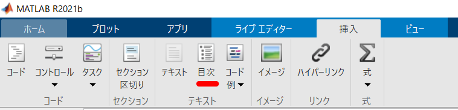

# Table of contents
- [はじめに](#はじめに)
- [table of contents とは？](#table-of-contents-とは？)
- [どうやったか](#どうやったか)
- [セクション名のリスト抽出](#セクション名のリスト抽出)
- [目次作成](#目次作成)
- [同じ id があるとうまく機能しない](#同じ-id-があるとうまく機能しない)
- [id の文字列操作](#id-の文字列操作)
- [仕上げ！](#仕上げ！)
- [feedback](#feedback)

# Table of Contents の追加：Live Script から Markdown への自動変換

Copyright 2022 The MathWorks, Inc.

# はじめに

この README は [ライブスクリプト](https://jp.mathworks.com/help/matlab/matlab_prog/what-is-a-live-script-or-function.html) を Qiita/Github の Markdown に変換する際に Table of Contents (目次) の処理方法のメモです。変換機能自体については README_JP を確認ください。

生成される markdown に Table of Contents を追加する場合は ToC オプションを true に設定します。

```matlab:Code(Display)
latex2markdown('README_JP_sup.mlx',TOC = true);
```

関数のインストール方法については[【MATLAB】ライブスクリプトの Markdown 変換で楽して Qiita 投稿](https://qiita.com/eigs/items/513a17bd8cb2c5c5f435) を確認ください。該当する関数は [GitHub: livescript2markdown](https://github.com/minoue-xx/livescript2markdown) の [latex2markdown.m](https://github.com/minoue-xx/livescript2markdown/blob/master/function/latex2markdown.m) です。

# Table of Contents とは？

Livescript 上では「目次」ボタン（画像参照）から追加することができますが、今回追加した機能では livescript 上で目次が表示されているか否かに関わらず `ToC` オプションで markdown 側に追加するかどうかを選択可能です。



  
# どうやったか

livescript2markdown 自体は livescript を一旦 tex ファイルに変換したのちに、markdown へと変換しています。tex ファイルへの変換は MATLAB で提供されています。

生成される tex を見るとタイトルやサブセクションは以下のように出力されます。

```matlab:Code(Display)
\matlabtitle{タイトル}
\matlabheading{セクション１}
\matlabheadingtwo{サブセクション１}
\matlabheadingthree{サブサブセクション}
```

4つだけです。簡単ですね。さらに今回はタイトルは無視します。そして markdown で欲しい形は

```matlab:Code(Display)
# Table of contents
- [セクション](#セクション)
  - [サブセクション](#サブセクション)
    - [サブサブセクション](#サブサブセクション)
```

こんな感じです。[セクション](\#セクション) とすることで、markdown 内のハイパーリンクとなります。便利！ただ、ここで (\#セクション) と ID を設定しますが、注意が必要なのは以下の 3 点です。

   -  スペースは - (ハイフン) に変換 
   -  アルファベットは小文字に統一 
   -  同じ ID があるとうまく機能しない 

  
# セクション名のリスト抽出

ここは正規表現を使う [regexp](https://jp.mathworks.com/help/matlab/ref/regexp.html) の出番です。

```matlab:Code
str = "\matlabtitle{タイトル}" + newline ...
+ "\matlabheading{セクション１}" + newline ...
+ "\matlabheadingtwo{サブセクション１}" + newline ...
+ "\matlabheading{Section 2}" + newline ...
+ "\matlabheadingtwo{Subsection 2-1}" + newline ...
+ "\matlabheadingthree{サブサブセクション}";
```

このサンプル文字列でやってみますが、実際に処理する tex ファイルには、コードや結果やコメントなどたくさん混ざっています。

まず matlabheading 等に合致する箇所を探す場合はこれ。"match" を指定して、合致した文字列そのものを返してみます。

```matlab:Code
toc_str = regexp(str,"\\matlabheading(?:|two|three){([^{}]+)}","match");
toc_str'
```

```text:Output
ans = 5x1 string    
"\matlabheading{セクション１}"         
"\matlabheadingtwo{サブセクション１}"    
"\matlabheading{Section 2}"      
"\matlabheadingtwo{Subsection …  
"\matlabheadingthree{サブサブセクション}" 

```

ちゃんと 3 つ見つかっていますね。

   -  `()` はグループ化（トークン化） 
   -  `(?:)` と ? を付けるとトークン化しません 
   -  `(?:|two|three)` で matlabheading/matlabheadingtwo/matlabheadingthree の3種をカバー` `  
   \item{ `^{}`は、`{`と `}`以外の任意の文字 }
   -  `+` は`[]`で囲んだ文字のの1 回以上の繰り返し 

ってなところです。

# 目次作成

ここで一気に markdown の目次の形式に変換しちゃいます。

```matlab:Code
% generate ToC with hyperlink for markdown
toc_md = regexprep(toc_str,"\\matlabheading{([^{}]+)}","- [$1](#$1)");
toc_md = regexprep(toc_md,"\\matlabheadingtwo{([^{}]+)}","  - [$1](#$1)");
toc_md = regexprep(toc_md,"\\matlabheadingthree{([^{}]+)}","    - [$1](#$1)");
toc_md'
```

```text:Output
ans = 5x1 string    
"- [セクション１](#セクション１)"                
"  - [サブセクション１](#サブセクション１)"          
"- [Section 2](#Section 2)"          
"  - [Subsection 2-1](#Subsection …  
"    - [サブサブセクション](#サブサブセクション)"      

```

   -  `()` はグループ化（トークン化） 
   \item{ `^{}`は、`{`と `}`以外の任意の文字 }
   -  `+` は`[]`で囲んだ文字のの1 回以上の繰り返し 
   -  $1 はトークン化した文字列 

ってなところです。Markdown ではセクションの階層はインデント（スペース）で表しますので、変換時に空白を加えています。

これで形は完成！！なんですが上でも触れた通り (\#セクション) と ID 設定している部分がちょっと面倒です。注意が必要の以下の3点について処理を行います。

   -  スペースは - (ハイフン) に変換 
   -  アルファベットは小文字に統一 
   -  同じ ID があるとうまく機能しない 

# 同じ ID があるとうまく機能しない

セクション名が被っている・・ここは潔くあきらめて warning をだすに留めます。

上では "match" で合致した文字列全体を取り出しましたが、代わりに "tokens" を使うと、以下の通り `([^{}]+)` に該当する文字列だけを取り出せます。

```matlab:Code
toc_id = regexp(str,"\\matlabheading(?:|two|three){([^{}]+)}","tokens");
toc_id'
```

| |1|
|:--:|:--:|
|1|"セクション１"|
|2|"サブセクション１"|
|3|"Section 2"|
|4|"Subsection 2-1"|
|5|"サブサブセクション"|

こんな感じ。これを ID に使いますが、重複があれば warning を出しておきます。

```matlab:Code
% check if any duplicate id for toc
toc_id = string(toc_id);
if length(toc_id) ~= length(unique(toc_id))
    warning("latex2markdown:ToCdupID","Duplication in section title is found. Some hyperlinks in ToC may not work properly.")
end
```

# ID の文字列操作

これが一気に処理できればいいのですが、パッと思いつかなかったのでループで実直に行きます。それぞれ使える関数があります。

   -  スペースは - (ハイフン) に変換： [replace](https://jp.mathworks.com/help/matlab/ref/replace.html) 関数 
   -  アルファベットは小文字に統一：[lower](https://jp.mathworks.com/help/matlab/ref/lower.html) 関数 

```matlab:Code
ids = regexp(toc_md,"\(#.*\)","match"); % ID 部分の文字列を抽出
ids'
```

| |1|
|:--:|:--:|
|1|"(\#セクション１)"|
|2|"(\#サブセクション１)"|
|3|"(\#Section 2)"|
|4|"(\#Subsection 2-1)"|
|5|"(\#サブサブセクション)"|

この ID を 1 つずつ処理して markdown 形式に変換した文字列内で置き換えます。

```matlab:Code
for ii=1:length(ids) % for each IDs
    tmp1 = ids{ii}; 
    tmp2 = replace(tmp1," ","-"); % space is replased by -.
    tmp2 = lower(tmp2); % lower case
    % replace ID string with a new string
    toc_md = replace(toc_md,tmp1,tmp2);
end
toc_md'
```

```text:Output
ans = 5x1 string    
"- [セクション１](#セクション１)"                
"  - [サブセクション１](#サブセクション１)"          
"- [Section 2](#section-2)"          
"  - [Subsection 2-1](#subsection-…  
"    - [サブサブセクション](#サブサブセクション)"      

```

# 仕上げ！

あとは目次のタイトルと一緒に結合して完成です。ToC オプションを true にして実行すると、生成される markdown の冒頭に挿入されます。

```matlab:Code
toc_md = ["# Table of contents", toc_md]; % add tile
% join the strings
toc_md = join(toc_md,newline)
```

```text:Output
toc_md = 
    "# Table of contents
     - [セクション１](#セクション１)
       - [サブセクション１](#サブセクション１)
     - [Section 2](#section-2)
       - [Subsection 2-1](#subsection-2-1)
         - [サブサブセクション](#サブサブセクション)"

```

# Feedback

何か気になることがあれば遠慮なくコメントください。
