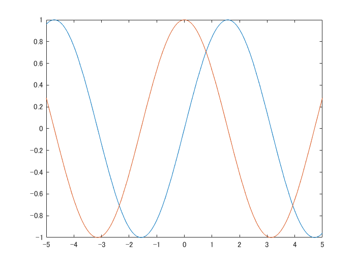

# Symbolic Math Example


Copyright 2020 The MathWorks, Inc.


```matlab:Code
syms theta
f = sin(theta)
```

f = 

   

```matlab:Code
df = diff(f,theta)
```

df = 

   

```matlab:Code
fplot(f)
hold on
fplot(df)
hold off
```





```matlab:Code
a = [cos(theta), -sin(theta),0,0
    sin(theta),cos(theta),0,0
    0,0,1,0
    0,0,0,1]
```

a = 

   

```matlab:Code
b = [1,0,0,0
    0,0,-1,0
    0,1,0,0
    0,0,0,1]
```


```text:Output
b = 4x4    
     1     0     0     0
     0     0    -1     0
     0     1     0     0
     0     0     0     1

```


```matlab:Code
a*b
```

ans = 

   
